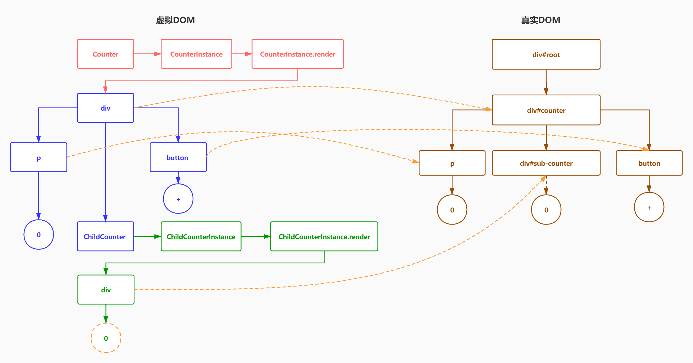

<!--
 * @Author: cc
 * @LastEditTime: 2022-01-29 15:05:28
-->

### React jsx 语法基于 Babel 解析

<br/>


```javaScript

// 真实Dom
 <div className="box" style={{color:'red'}}>
  <span>1</span>
  <p>2</p>
</div>

// 转换结果
 {
  type:"div",
  props:{
    className:"box"
  },
  children:[{
    type:"span",
    props:{
      style:{
        color:"red"
      },
      children:"hello"
    },
  },{
    type:"p",
    props:null,
    children:"2"
  }]
}
```

### React

1. React 元素不可变,不可以改变元素类型，例如{type:h1}修改为{type:h2}，禁止修改对象属性 Object.freeze(object)，其实就是改变 writeable 属性为 false

2. React 元素采用局部更新，只更新可变部分，domDiff

### 函数组件

1. 自定义组件必须是首字母大写 原生组件小写开头，自定义组件大写字母开头

2. 组件必须使用前先定义

3. 组件必须返回并且只能返回一个根元素

### 合成事件和批量更新

<br/>


1. 在 React 中，事件的更新可能是异步的，是批量的，例如同时触发多个 setState

2. 调用 setState 状态并没有立刻更新，而是先缓存起来

3. 等事件处理函数执行完毕之后，再进行批量更新，一次更新并重新渲染

4. 因为 jsx 是由 React 函数控制，只要归 React 控制就是批量，只要不归 react 管，就是非批量

```javaScript
    this.setState({number:this.state.number+1});
    console.log(this.state.number); // 0
    this.setState({number:this.state.number+1});
    console.log(this.state.number); // 0
    // 第一个参数，获取最新的state
    // 第二个参数，回调函数，获取最新的state
    this.setState((lastState)=>{number:lastState.number+1},()=>{
        console.log(this.state.number) // 1
    })
     this.setState((lastState)=>{number:lastState.number+1},()=>{
        console.log(this.state.number) // 1
    })
    Promise.resolve().then(()=>{
        console.log(this.state.number); // 2
        this.setState({number:this.state.number+1});
        console.log(this.state.number); // 3
        sthis.etState({number:this.state.number+1});
        console.log(this.state.number); // 4
    })

```

### react 生命周期

<br/>


```javaScript
父组件 1.constructor 初始化属性和状态对象
父组件 2.componentWillMount 组件将要挂载
父组件 3.render 重新计算新的虚拟DOM
子组件 1.componentWillMount 组件将要挂载
子组件 2.render
子组件 3.componentDidMount 组件挂载完成
父组件 4.componentDidMount 组件挂载完成
父组件 5.shouldComponentUpdate 决定组件是否需要更新?
父组件 5.shouldComponentUpdate 决定组件是否需要更新?
父组件 6.componentWillUpdate 组件将要更新
父组件 3.render 重新计算新的虚拟DOM
子组件 4.componentWillReceiveProps 组件将要接收到新的属性
子组件 5.shouldComponentUpdate 决定组件是否需要更新?
父组件 7.componentDidUpdate 组件更新完成
父组件 5.shouldComponentUpdate 决定组件是否需要更新?
父组件 5.shouldComponentUpdate 决定组件是否需要更新?
父组件 6.componentWillUpdate 组件将要更新
父组件 3.render 重新计算新的虚拟DOM
子组件 6.componentWillUnmount 组件将要卸载
父组件 7.componentDidUpdate 组件更新完成
父组件 5.shouldComponentUpdate 决定组件是否需要更新?
父组件 5.shouldComponentUpdate 决定组件是否需要更新?
父组件 6.componentWillUpdate 组件将要更新
父组件 3.render 重新计算新的虚拟DOM
子组件 1.componentWillMount 组件将要挂载
子组件 2.render
子组件 3.componentDidMount 组件挂载完成
父组件 7.componentDidUpdate 组件更新完成
父组件 5.shouldComponentUpdate 决定组件是否需要更新?
父组件 5.shouldComponentUpdate 决定组件是否需要更新?
父组件 6.componentWillUpdate 组件将要更新
父组件 3.render 重新计算新的虚拟DOM
子组件 4.componentWillReceiveProps 组件将要接收到新的属性
子组件 5.shouldComponentUpdate 决定组件是否需要更新?
父组件 7.componentDidUpdate 组件更新完成
父组件 5.shouldComponentUpdate 决定组件是否需要更新?
父组件 5.shouldComponentUpdate 决定组件是否需要更新?
父组件 6.componentWillUpdate 组件将要更新
父组件 3.render 重新计算新的虚拟DOM
子组件 4.componentWillReceiveProps 组件将要接收到新的属性
子组件 5.shouldComponentUpdate 决定组件是否需要更新?
父组件 7.componentDidUpdate 组件更新完成
父组件 5.shouldComponentUpdate 决定组件是否需要更新?
父组件 5.shouldComponentUpdate 决定组件是否需要更新?
父组件 6.componentWillUpdate 组件将要更新
父组件 3.render 重新计算新的虚拟DOM
子组件 4.componentWillReceiveProps 组件将要接收到新的属性
子组件 5.shouldComponentUpdate 决定组件是否需要更新?
子组件 6.componentWillUpdate 组件将要更新
子组件 2.render
子组件 7.componentDidUpdate 组件更新完成
父组件 7.componentDidUpdate 组件更新完成
```

### domDiff

https://mp.weixin.qq.com/s/Zi4spufaPxeZTMbjj_b55A


