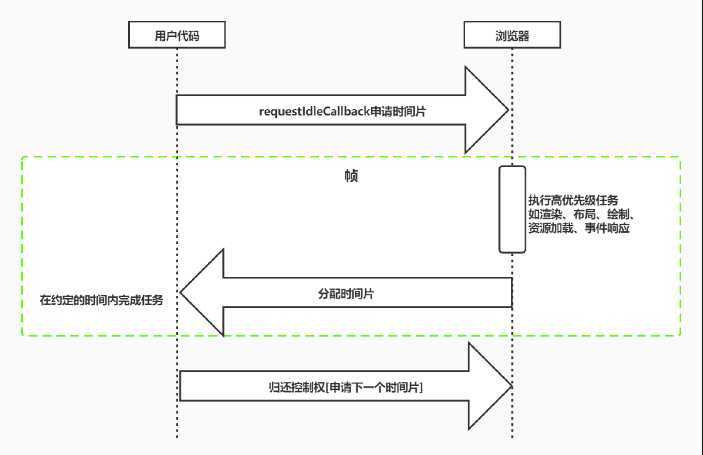
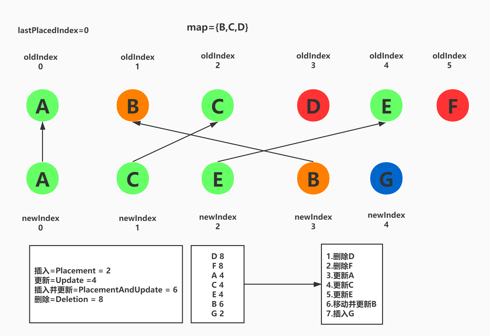

<!--
 * @Author: cc
 * @LastEditTime: 2022-08-06 20:21:45
-->

## 📦 安装依赖

```shell
npm i
```

## ⌨️ 运行：

```shell
 npm run dev
```

---

## React 渲染过程

快速响应->异步可中断(Fiber)+增量更新(dom diff)

- 性能瓶颈 Js 执行时间过长

  浏览器的刷新频率假设为 60hz，大概 (1 秒/60)16.6 毫秒更新一次，而 js 的线程和渲染线程是相斥的，如果 js 执行任务时间超过 16.6 毫秒，就会导致掉帧，解决方案就是 React 利用空闲时间进行更新，不影响渲染进行渲染。

- 帧

  每个帧的开头包含样式计算、布局和绘制，javaScript 执行 js 引擎和页面渲染在同一个渲染线程 GUI 和 js 执行是相斥的(因为 js 可以修改 dom)，所以利用 requestIdleCallback(由于兼容性，react 使用 MessageChannel+requestAnimationFrame 模拟) 在每一帧的空闲时间执行任务



---

## DomDiff

DomDiff 的过程其实就是老的 Fiber 树 和 新的 jsx 对比生成新的 Fiber 树 的过程

单节点

1.新旧节点 type 和 key 都不一样，标记为删除

2.如果对比后发现新老节点一样的，那么会复用老节点，复用老节点的 DOM 元素和 Fiber 对象
再看属性有无变更 ，如果有变化，则会把此 Fiber 节点标准为更新

3.如果 key 相同，但是 type 不同，则不再进行后续对比了，
直接把老的节点全部删除


多节点

1.如果新的节点有多个的话
我们经过二轮遍历
第一轮处理更新的情况 属性和类型 type 的更新 更新或者说保持 不变的频率会比较高
第二轮处理新增 删除 移动 的情况

```javaScript
  <ul>
    <li key="A">A</li>
    <li key="B">B</li>
    <li key="C">C</li>
    <li key="D">D</li>
    <li key="E">E</li>
    <li key="F">F</li>
    </ul>
    /*************/
    <ul>
    <li key="A">A-NEW</li>
    <li key="C">C-NEW</li>
    <li key="E">E-NEW</li>
    <li key="B">B-NEW</li>
    <li key="G">G-NEW</li>
  </ul>
  如果第一轮遍历的时候，发现key不一样，则立刻跳出第一轮循环
  key不一样，说明可能有位置变化，更新A

  第二轮循环，新建map={"B":"B","C":"C","D":"D","E":"E","F":"F"}，可以复用的节点标记为更新，从map中删除，然后map={"D":"D","F":"F"}，还没有被复用的fiber节点，等新的jsx数组遍历完之后，把map中的所有节点标记为删除，再更新，然后移动，记录第一轮的lastPlaceIndex，最小的oldIndex移动，最后插入新元素。
```



---

## 事件合成

React 会把事件绑定在 render 函数的节点上，React16 版本为 document 上，但是 React 在 document 会模拟捕获和冒泡流程，导致和浏览器表现不一致

```javaScript
  // element.addEventListener(event, function, useCapture) useCapture === true ? '捕获' : '冒泡'，默认冒泡
  // e.preventDefault() 阻止事件默认行为
  // onClickCapture 捕获 onClick 冒泡
  // React16由于会冒泡到docuemnt上执行，所以会导致最后show为false
    componentDidMount(){
      this.setState({
        show:false
      })
    }
    handleClick = (event)=>{
      // event.nativeEvent.stopProgation(); // 不再向上冒泡了，但是本元素剩下的函数还会执行，也就是React16的话，依然会执行
      // event.nativeEvent.stopImmediateProgation(); // 阻止监听同一事件的其他事件监听器被调用，阻止后续事件代理到docuemnt上，可以解决React16合成事件的问题
      this.setState({
        show:true
      })
    }
    <button onClick={this.handleClick}></button>
    {this.state.show && <a>显示</a>}
```


---

参考链接 [React 技术解密](https://react.iamkasong.com/) https://react.iamkasong.com/
