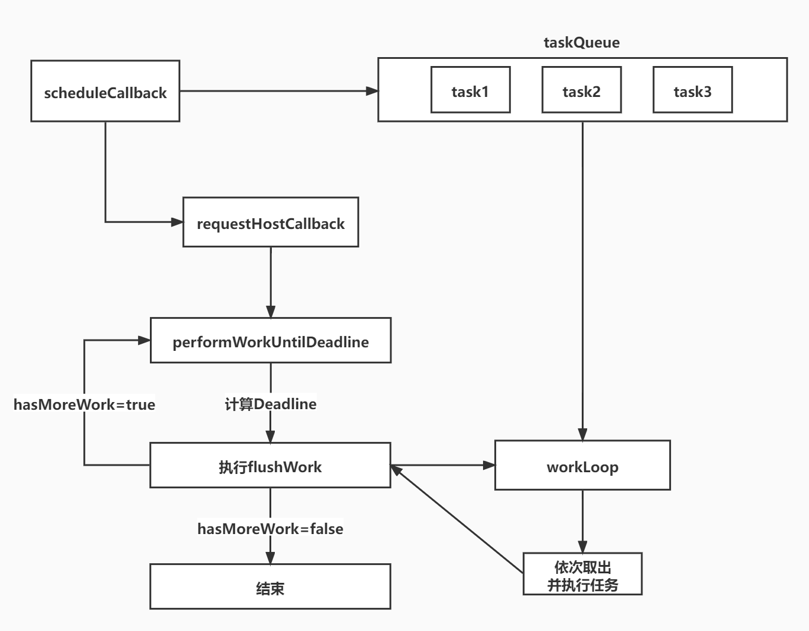
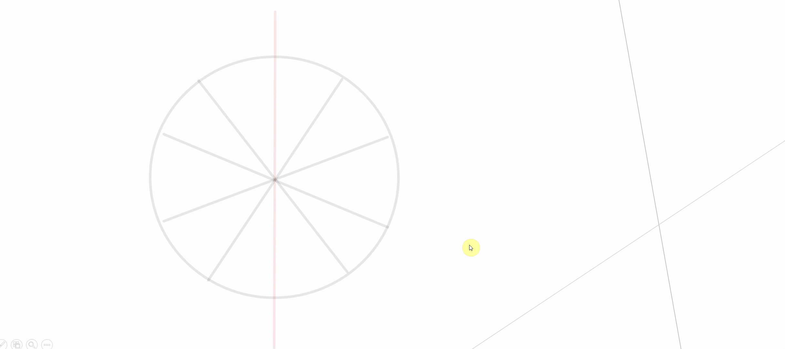
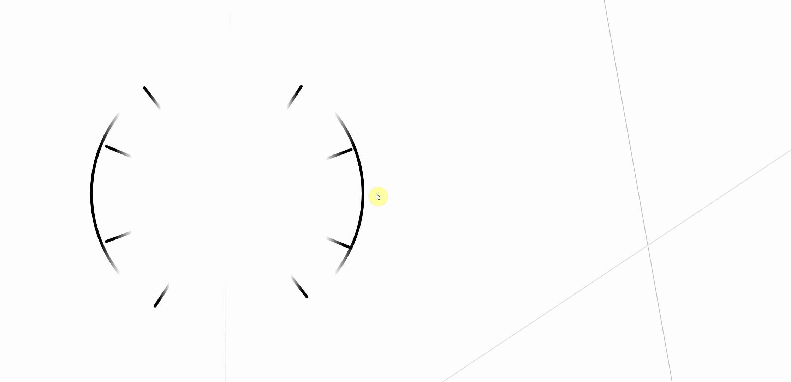
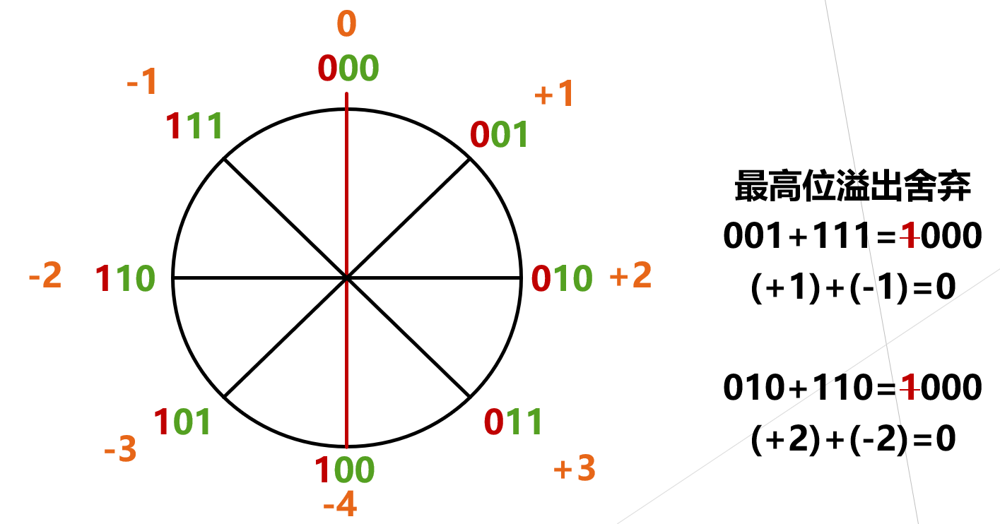

<!--
 * @Author: cc
 * @LastEditTime: 2023-03-24 15:07:05
-->


## 主要内容

### 基础
- [reactElement](./docs/reactElement.md)
- [fiber对象](./docs/fiber.md)
- [fiber中的update对象](./docs/updateQueue.md)
- [hook对象](./docs/hook.md)
- [React事件合成](./docs/event.md)

### 调度

- [domDiff的实现](./docs/domDiff.md)
- [任务调度](./docs/reconciler.md)


### collectEffectList

作为DOM操作的依据，commit阶段需要找到所有有effectTag的Fiber节点并依次执行effectTag对应操作。难道需要在commit阶段再遍历一次Fiber树寻找effectTag !== null的Fiber节点么？

这显然是很低效的。

为了解决这个问题，在completeWork的上层函数completeUnitOfWork中，每个执行完completeWork且存在effectTag的Fiber节点会被保存在一条被称为effectList的单向链表中。

effectList中第一个Fiber节点保存在fiber.firstEffect，最后一个元素保存在fiber.lastEffect。

类似appendAllChildren，在“归”阶段，所有有effectTag的Fiber节点都会被追加在effectList中，最终形成一条以rootFiber.firstEffect为起点的单向链表。

这样，在commit阶段只需要遍历effectList就能执行所有effect了。


```javaScript

  function collectEffectList(returnFiber, completedWork) {
    if (returnFiber) {
      //如果父亲 没有effectList,那就让父亲 的firstEffect链表头指向自己的头
      if (!returnFiber.firstEffect) {
        returnFiber.firstEffect = completedWork.firstEffect;
      } 
      //如果自己有链表尾
      if (completedWork.lastEffect) {
        //并且父亲也有链表尾
        if (returnFiber.lastEffect) {
          //把自己身上的effectlist挂接到父亲的链表尾部
          returnFiber.lastEffect.nextEffect = completedWork.firstEffect;
        }
        returnFiber.lastEffect = completedWork.lastEffect;
      }
      var flags = completedWork.flags; //如果此完成的fiber有副使用，那么就需要添加到effectList里
      if (flags) {
        //如果父fiber有lastEffect的话，说明父fiber已经有effect链表
        if (returnFiber.lastEffect) {
          returnFiber.lastEffect.nextEffect = completedWork;
        } else {
          returnFiber.firstEffect = completedWork;
        }

        returnFiber.lastEffect = completedWork;
      }
    }
  }
  let rootFiber = { key: 'rootFiber' };
  let fiberA = { key: 'A', flags: Placement };
  let fiberB = { key: 'B', flags: Placement };
  let fiberC = { key: 'C', flags: Placement };
  //B把自己的fiber给A
  collectEffectList(fiberA, fiberB);
  collectEffectList(fiberA, fiberC);
  collectEffectList(rootFiber, fiberA);  //rootFiber->A-B->C 
  
```

### 优先级

```javaScript 

  // 优先级
  export const NoPriority = 0;           // 没有任何优先级
  export const ImmediatePriority = 1;    // 立即执行的优先级，级别最高
  export const UserBlockingPriority = 2; // 用户阻塞级别的优先级
  export const NormalPriority = 3;       // 正常的优先级
  export const LowPriority = 4;          // 较低的优先级
  export const IdlePriority = 5;         // 优先级最低，表示任务可以闲置

  // 不同的优先级对应不同的过期时间
  let maxSigned31BitInt = 1073741823;
  let IMMEDIATE_PRIORITY_TIMEOUT = -1; //立即执行的优先级，级别最高
  let USER_BLOCKING_PRIORITY_TIMEOUT = 250; //用户阻塞级别的优先级
  let NORMAL_PRIORITY_TIMEOUT = 5000; //正常的优先级
  let LOW_PRIORITY_TIMEOUT = 10000; //较低的优先级
  let IDLE_PRIORITY_TIMEOUT = maxSigned31BitInt; //优先级最低，表示任务可以闲置
```

优先级的核心是使用数组模拟最小优先队列，核心文件是 SchedulerMinHeap.ts

```javaScript

    function push(){}  // 添加一个元素并调整最小堆
    function peek(){} // 查看一下堆顶的元素
    function pop(){}  // 取出并删除堆顶的元素，并调整最小堆

```

模拟React中的时间切片，单个任务，React当中是多任务，用的数组模拟的最小堆(taskQueue)

```javaScript
    let result = 0;
    let i = 0;
    //截止时间
    let deadline = 0;
    //当前正在调度执行的工作
    let scheduledHostCallback = null;
    //每帧的时间片5ms
    let yieldInterval = 5;
    // 新建MessageChannel
    const { port1, port2 } = new MessageChannel();
    // port2调用postMessage这里执行port1的onMessage的回调
    port1.onmessage = performWorkUntilDeadline;
    function scheduleCallback(callback) {
        scheduledHostCallback = callback;
        port2.postMessage(null);
    }
    /*总任务*/
    function calculate() {
        for (; i < 10000000 && (!shouldYield()); i++) {//7个0
            result += 1;
        }
        // 任务没有完成，返回任务本身
        if (result < 10000000) {
            return calculate;
        } else {
          // 任务完成，返回null进行终止操作
            return null;
        }

    }
    scheduleCallback(calculate);
    /**
     * 执行工作直到截止时间
     */
    function performWorkUntilDeadline() {
        // 获取当前的执行时间，相比Date.now更加精准
        const currentTime = performance.now();
        // 计算截止时间
        deadline = currentTime + yieldInterval;
        // 执行工作
        const hasMoreWork = scheduledHostCallback();
        // 如果此工作还没有执行完，则再次调度
        if (hasMoreWork) {
        // 触发port1的onMessage
            port2.postMessage(null);
        }
    }
    /**
     * 判断是否到达了本帧的截止时间
     * @returns 是否需要暂停执行
     */
    function shouldYield() {
        const currentTime = performance.now();
        return currentTime >= deadline;
    };
```

任务队列，多个任务的情况


### 时间切片

时间分片的异步渲染是优先级调度实现的前提，本质是模拟requestIdleCallback

```javaScript
  一个task(宏任务) -- 队列中全部job(微任务) -- requestAnimationFrame -- 浏览器重排/重绘 -- requestIdleCallback
```

requestIdleCallback是在“浏览器重排/重绘”后如果当前帧还有空余时间时被调用的。

浏览器并没有提供其他API能够在同样的时机（浏览器重排/重绘后）调用以模拟其实现。

唯一能精准控制调用时机的API是requestAnimationFrame，他能让我们在“浏览器重排/重绘”之前执行JS。

这也是为什么我们通常用这个API实现JS动画 —— 这是浏览器渲染前的最后时机，所以动画能快速被渲染。

所以，退而求其次，Scheduler的时间切片功能是通过task（宏任务）实现的。

最常见的task当属setTimeout了。但是有个task比setTimeout执行时机更靠前，那就是MessageChannel (opens new window)。

所以Scheduler将需要被执行的回调函数作为MessageChannel的回调执行。如果当前宿主环境不支持MessageChannel，则使用setTimeout




### 位运算相关

```javaScript
 // 一般来说n比特的的信息量可以表示出2的n次方选择
 // 4个bit 2的3次方选择 从后往前到1，Math.pow(2,0) Math.pow(2,1) Math.pow(2,2) Math.pow(2,3)
 // 表示范围就是0-7
 let a = 0b1000; // 2*2*2 == 8 == Math.pow(2,3)
 let a = 0b10000; // 16
 let a = 0b100000; // 32
```

### 原码反码补码

计算器中其实只用了补码

原码：符号: 用0、1表示正负号,放在数值的最高位,0表示正数，1表示负数

3个bit能表示8个数 +0 +1 +2 +3 -0 -1 -2 -3



反码：正数不变,负数的除符号位外取反，加法可以实现减法



补码

补码:正数不变,负数在反码的基础上加1

补码解决了,可以带符号位进行运算,不需要单独标识

补码解决了自然码正负0的表示方法

补码实现了减法变加法



### 位运算

|  运算   | 使用  | 说明 |
|  ----  | ----  | ----    |
|按位与(&)	|x & y |	每一个比特位都为1时，结果为1，否则为0|
|按位或()	|x  y |	每一个比特位都为0时，结果为0，否则为1|
|按位异或(^)|	x ^ y	|每一个比特位相同结果为0，否则为1|
|按位非(~)	|~ x|	对每一个比特位取反，0变为1，1变为0|
|左移(<<)	|x << y|	将x的每一个比特位左移y位，右侧补充0|
|有符号右移(>>)	|x >> y|	将x的每一个比特位向右移y个位，右侧移除位丢弃，左侧填充为最高位|
|无符号右移(>>>)	|x >>> y|	将x的每一个比特位向右移y个位，右侧移除位丢弃，左侧填充为0|


### 完全二叉树

叶子结点只能出现在最下层和次下层,且最下层的叶子结点集中在树的左部


### 最小堆

最小堆是一种经过排序的完全二叉树，在React源码中使用数组进行的模拟。

其中任一非终端节点的数据值均不大于其左子节点和右子节点的值，根结点值是所有堆结点值中最小者

根据子节点下标推算父节点下标：parentIndex = (childIndex - 1) >>> 1 (位运算)

根据父节点下标推算子节点下标：leftIndex = (index +1 )2 - 1,rightIndex = leftIndex + 1


### SchedulerMinHeap.js 

peek() 查看堆的顶点

pop() 弹出堆的定点后需要调用siftDown函数向下调整堆

push() 添加新节点后需要调用siftUp函数向上调整堆

siftDown() 向下调整堆结构, 保证最小堆

siftUp() 需要向上调整堆结构, 保证最小堆

