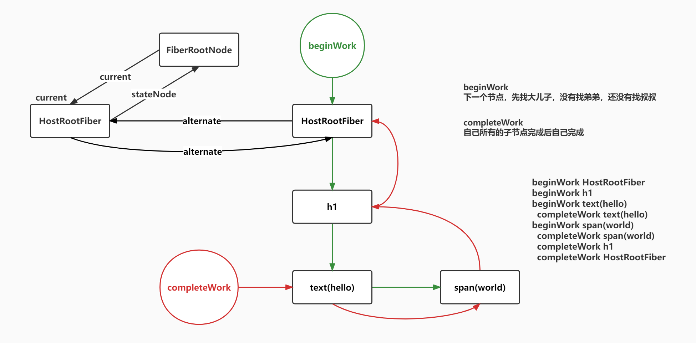

前置知识

- [二进制](./markdown/&|.md)

- [深度优先遍历与广度有限遍历](./markdown/dfs.md)

### Fiber 结构

Fiber 是一种数据结构

- React 目前的做法是使用链表, 每个虚拟节点内部表示为一个 Fiber

- 从顶点开始遍历

- 如果有第一个儿子，先遍历第一个儿子

- 如果没有第一个儿子，标志着此节点遍历完成

- 如果有弟弟遍历弟弟

- 如果有没有下一个弟弟，返回父节点标识完成父节点遍历，如果有叔叔遍历叔叔

- 没有父节点遍历结束


```javaScript
  /**
 *
 * @param {*} tag fiber的类型 函数组件0  类组件1 原生组件5 根元素3
 * @param {*} pendingProps 新属性，等待处理或者说生效的属性
 * @param {*} key 唯一标识
 */
export function FiberNode(tag, pendingProps, key) {
  this.tag = tag;
  this.key = key;
  this.type = null; //fiber类型，来自于 虚拟DOM节点的type  span div p
  //每个虚拟DOM=>Fiber节点=>真实DOM
  this.stateNode = null; //此fiber对应的真实DOM节点  h1=>真实的h1DOM

  this.return = null; //指向父节点
  this.child = null; //指向第一个子节点
  this.sibling = null; //指向弟弟

  //fiber哪来的？通过虚拟DOM节点创建，虚拟DOM会提供pendingProps用来创建fiber节点的属性
  this.pendingProps = pendingProps; //等待生效的属性
  this.memoizedProps = null; //已经生效的属性

  //每个fiber还会有自己的状态，每一种fiber 状态存的类型是不一样的
  //类组件对应的fiber 存的就是类的实例的状态,HostRoot存的就是要渲染的元素
  this.memoizedState = null;
  //每个fiber身上可能还有更新队列
  this.updateQueue = null;
  //副作用的标识，表示要针对此fiber节点进行何种操作
  this.flags = NoFlags; //自己的副作用
  //子节点对应的副使用标识
  this.subtreeFlags = NoFlags;
  //替身，轮替 在后面讲DOM-DIFF的时候会用到
  this.alternate = null;
  this.index = 0;
  this.deletions = null;
  this.lanes = NoLanes;
  this.childLanes = NoLanes;
  this.ref = null;
}
```

### createRoot

确定渲染的根节点，同时调用`createFiberRoot`，创建 Fiber 的根节点，FiberRootNode = containerInfo,它的本质就是一个真实的 DOM 节点，div#root，
其实就是一个真实的 DOM 节点

```javaScript
// div#root
function ReactDOMRoot(internalRoot) {
  this._internalRoot = internalRoot;
}
// 创建根节点
export function createRoot(container) {// div#root
  // 创建Fiber的根节点
  const root = createContainer(container);
  // 增加事件监听
  listenToAllSupportedEvents(container);
  return new ReactDOMRoot(root);
}
export function createContainer(containerInfo) {
   // 创建Fiber的根节点
  return createFiberRoot(containerInfo);
}
// 创建根Fiber
export function createFiberRoot(containerInfo) {
  const root = new FiberRootNode(containerInfo);
  //HostRoot指的就是根节点div#root
  const uninitializedFiber = createHostRootFiber();
  //根容器的current指向当前的根fiber
  root.current = uninitializedFiber;
  //根fiber的stateNode,也就是真实DOM节点指向FiberRootNode
  uninitializedFiber.stateNode = root;
  // 初始化更新队列
  initialUpdateQueue(uninitializedFiber);
  return root;
}
function FiberRootNode(containerInfo) {
  this.containerInfo = containerInfo;//div#root
  //表示此根上有哪些赛道等待被处理
  this.pendingLanes = NoLanes;
  this.callbackNode = null;
  this.callbackPriority = NoLane;
  //过期时间 存放每个赛道过期时间
  this.expirationTimes = createLaneMap(NoTimestamp);
  //过期的赛道
  this.expiredLanes = NoLanes;
}

```

### initialUpdateQueue 函数进行初始更新队列

Fiber 的`updateQueue`链表会在`processUpdateQueue`函数中根据老状态和更新队列中的更新计算最新的状态。

```javaScript

export function createFiberRoot(containerInfo) {
  const root = new FiberRootNode(containerInfo);
  //HostRoot指的就是根节点div#root
  const uninitializedFiber = createHostRootFiber();
  //根容器的current指向当前的根fiber
  root.current = uninitializedFiber;
  //根fiber的stateNode,也就是真实DOM节点指向FiberRootNode
  uninitializedFiber.stateNode = root;
  initialUpdateQueue(uninitializedFiber);
  return root;
}

export function initialUpdateQueue(fiber) {
  //创建一个新的更新队列
  //pending其实是一个循环链接
  const queue = {
    baseState: fiber.memoizedState,//本次更新前当前的fiber的状态,更新会其于它进行计算状态
    firstBaseUpdate: null,//本次更新前该fiber上保存的上次跳过的更新链表头
    lastBaseUpdate: null,//本次更新前该fiber上保存的上次跳过的更新链尾部
    shared: {
      pending: null,
    },
  };
  fiber.updateQueue = queue;
}
```

### 渲染阶段

React 渲染可以概括为：两大阶段，五小阶段

**render 阶段**

- beginWork:目标是根据新虚拟 DOM 构建新的 fiber 子链表

- completeUnitOfWork:完成一个 Fiber 节点，通过`bubbleProperties`，遍历当前 fiber 的所有子节点，把所有的子节的副作用，以及子节点的子节点的副作用全部合并，以及创建真实的 DOM 节点，也就是 Fiber 上的`stateNode`属性

**commit 阶段**

- commitRoot:提交渲染完的根节点。

- commitMutationEffectsOnFiber:通过`recursivelyTraverseMutationEffects`遍历子节点，处理子节点上的副作用。

- commitReconciliationEffects:往真实 DOM 树中插入 DOM 节点。

### beginWork

`beginWork` 函数自身就是一个简单的基于 `fiber.tag` 的 switch 语句，这个阶段的逻辑主要在各个分支函数中。`beginWork` 最主要的工作：

协调。根据 beginWork 函数中 传入的 `current` 和 `workinProgress` 构建新的 Fiber 链表，即 DOM DIFF。

标记副作用。在协调子元素的过程中，会根据子元素是否增删改，从而将新的 newFiber 子节点的 flags 更新为对应的值。

返回新的子 fiber 节点作为下一个工作的 fiber 节点

模拟 React 中 `processUpdateQueue`函数，根据老状态和更新队列中的更新计算最新的状态。

```javaScript
/**
 * 建立排队更新
 */
function enqueueUpdate(fiber, update) {
  const updateQueue = fiber.updateQueue;
  const shared = updateQueue.shared;
  const pending = shared.pending;
  // 如果是空的，next指向自己
  if (pending === null) {
    update.next = update;
  } else {
    //如果更新队列不为空的话，取出第一个更新
    update.next = pending.next;
    //然后让原来队列的最后一个的next指向新的next，
    pending.next = update;
  }
  // pending永远指向最后一个更新,最后一个更新next指向第一个更新
  updateQueue.shared.pending = update;
}
/**
 * 更新最终的队列
 */
function processUpdateQueue(fiber) {
  const queue = fiber.updateQueue;
  const pending = queue.shared.pending;
  if (pending !== null) {
    queue.shared.pending = null;
    //最后一个更新
    const lastPendingUpdate = pending;
    const firstPendingUpdate = lastPendingUpdate.next;
    //把环状链接剪开,这里就成了单向链表
    lastPendingUpdate.next = null;
    let newState = fiber.memoizedState;
    let update = firstPendingUpdate;
    // 如果有next就继续循环
    while (update) {
      newState = getStateFromUpdate(update, newState);
      // 指向下一个链表节点
      update = update.next;
    }
    fiber.memoizedState = newState;
  }
}
/**
 * 根据老状态计算新状态
 */
function getStateFromUpdate(update, prevState) {
  return Object.assign({}, update.payload, prevState);
}
let fiber = { memoizedState: { sex: "男" } };
initialUpdateQueue(fiber);

let update1 = createUpdate();
update1.payload = { age: 18 };
enqueueUpdate(fiber, update1);

let update2 = createUpdate();
update2.payload = { name: "cc" };
enqueueUpdate(fiber, update2);

// fiber的udpateQueue也就是圆形链表
// const fiberRsult = {
//   memoizedState: { sex: "男" },
//   updateQueue: {
//     shared: {
//       pending: {
//         payload: { age: 18 },
//         next: {
//           payload: { name: "cc" },
//           next: [Circular * 1],
//         },
//       },
//     },
//   },
// };

//基于老状态，计算新状态
processUpdateQueue(fiber);
console.log(fiber.memoizedState); // { name: 'cc', age: 18, sex: '男' }

```



### completeWork

当一个 fiber 节点没有子节点，或者子节点仅仅是单一的字符串或者数字时，说明这个 fiber 节点当前的 `beginWork` 已经完成，可以进入`completeUnitOfWork` 完成工作。

`completeUnitOfWork` 主要工作如下：

- 调用 `completeWork` 创建真实的 DOM 节点，属性赋值等

- 通过调用 `bubbleProperties` 合并 `subtreeFlags`与 `flags`合并副作用

- 如果有兄弟节点，则返回兄弟节点，兄弟节点执行 beginWork。否则继续完成父节点的工作

```javaScript
/**
 * 完成一个fiber节点
 * @param {*} current 老fiber
 * @param {*} workInProgress 新的构建的fiber
 */
export function completeWork(current, workInProgress) {
  const newProps = workInProgress.pendingProps;
  switch (workInProgress.tag) {
    case HostRoot:
      bubbleProperties(workInProgress);
      break;
    //如果完成的是原生节点的话
    case HostComponent:
      ///现在只是在处理创建或者说挂载新节点的逻辑，后面此处分进行区分是初次挂载还是更新
      //创建真实的DOM节点
      const { type } = workInProgress;
      //如果老fiber存在，并且老fiber上真实DOM节点，要走节点更新的逻辑
      if (current !== null && workInProgress.stateNode !== null) {
        updateHostComponent(current, workInProgress, type, newProps);
        if (current.ref !== workInProgress.ref !== null) {
          markRef(workInProgress);
        }
      } else {
        const instance = createInstance(type, newProps, workInProgress);
        //把自己所有的儿子都添加到自己的身上
        appendAllChildren(instance, workInProgress);
        workInProgress.stateNode = instance;
        finalizeInitialChildren(instance, type, newProps);
        if (workInProgress.ref !== null) {
          markRef(workInProgress);
        }
      }
      bubbleProperties(workInProgress);
      break;
    case FunctionComponent:
      bubbleProperties(workInProgress);
      break;
    case HostText:
      //如果完成的fiber是文本节点，那就创建真实的文本节点
      const newText = newProps;
      //创建真实的DOM节点并传入stateNode
      workInProgress.stateNode = createTextInstance(newText);
      //向上冒泡属性
      bubbleProperties(workInProgress);
      break;
  }
}
```

`bubbleProperties`：遍历当前 fiber 的所有子节点，把所有的子节的副作用，以及子节点的子节点的副作用全部合并

```javaScript

function bubbleProperties(completedWork) {
  let newChildLanes = NoLanes;
  let subtreeFlags = NoFlags;
  //遍历当前fiber的所有子节点，把所有的子节的副作用，以及子节点的子节点的副作用全部合并
  let child = completedWork.child;
  while (child !== null) {
    newChildLanes = mergeLanes(newChildLanes, mergeLanes(child.lanes, child.childLanes));
    subtreeFlags |= child.subtreeFlags;
    subtreeFlags |= child.flags;
    child = child.sibling;
  }
  completedWork.childLanes = newChildLanes;
  completedWork.subtreeFlags = subtreeFlags;
}
```
