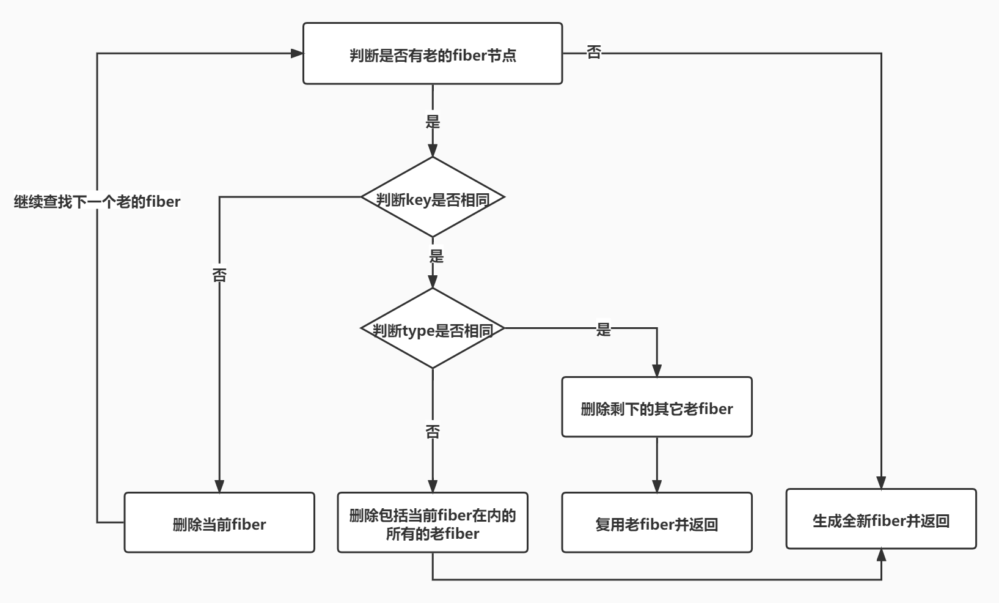

<!--
 * @Author: cc
 * @LastEditTime: 2023-01-07 15:05:07
-->
### React架构

1.**Scheduler**（调度器）—— 调度任务的优先级，高优任务优先进入Reconciler

2.**Reconciler**（协调器）—— 负责找出变化的组件

3.**Renderer**（渲染器）—— 负责将变化的组件渲染到页面上

<br/>

React是用**javaScript**构建快速响应的大型web应用的首选方式，何为快速响应？

当遇到大量操作计算或者设备性能产生的页面掉帧导致卡顿，发发送网络请求后，由于需要等待数据返回才能进一步操作导致不能快速响应，这两类场景可以概括为**CPU**的瓶颈和**IO**的瓶颈，react如何解决？

在浏览器每一帧的时间中，预留一些时间给JS线程，React利用这部分时间更新组件（可以看到，在源码 (opens new window)中，预留的初始时间是5ms）
ƒ
这种将长任务分拆到每一帧中，像蚂蚁搬家一样一次执行一小段任务的操作，被称为时间切片（time slice）

IO的瓶颈如何解决

为此，React实现了**Suspense**功能及配套的hook——useDeferredValue

而在源码内部，为了支持这些特性，同样需要将**同步的更新**变为**可中断的异步更新**

<br/>

### React 工作循环


### beginWork


### completeWork


### React切片

React分为两种模式,render和createRoot两种入口,分为**legacy**和**concurrent**两种

**legacy模式**(同步)

render调用legacyRenderSubtreeIntoContainer，最后createRootImpl会调用到createFiberRoot创建fiberRootNode,然后调用createHostRootFiber创建rootFiber，其中fiberRootNode是整个项目的的根节点，rootFiber是当前应用挂在的节点，也就是ReactDOM.render调用后的根节点


**concurrent**模式(异步)

createRoot调用createRootImpl创建fiberRootNode和rootNode，在createRootImpl中调用listenToAllSupportedEvents初始化事件注册

创建完Fiber节点后，调用ReactDOMRoot.prototype.render执行updateContainer，然后scheduleUpdateOnFiber异步调度performConcurrentWorkOnRoot进入render阶段和commit阶段

不同点

在函数scheduleUpdateOnFiber中根据不同优先级进入不同分支，legacy模式进入performSyncWorkOnRoot，concurrent模式会异步调度performConcurrentWorkOnRoot

<br/>

### Fiber双缓存树

1.react根据双缓冲机制维护了两个fiber树

current Fiber树：用于渲染页面

workinProgress Fiber树：用于在内存构建中，方便在构建完成后直接替换current Fiber树

2.Fiber双缓存

首次渲染时：
render阶段会根据jsx对象生成新的Fiber节点，然后这些Fiber节点会被标记成带有‘Placement’的副作用，说明他们是新增节点，需要被插入到真实节点中，在commitWork阶段就会操作成真实节点，将它们插入到dom树中。

页面触发更新时
render阶段会根据最新的jsx生成的虚拟dom和current Fiber树进行对比，比较之后生成workinProgress Fiber(workinProgress Fiber树的alternate指向Current Fiber树的对应节点，这些Fiber会带有各种副作用，比如‘Deletion’、‘Update’、'Placement’等)这一对比过程就是diff算法

当workinProgress Fiber树构建完成，workInprogress 则成为了curent Fiber渲染到页面上

diff ⽐较的是什么？ ⽐较的是 current fiber 和 vdom，⽐较之后⽣成 workInprogress Fiber

## 

<br/>

### Fiber数据结构

**BaseFiberRootProperties**定义了fiberRoot大部分属性

```javaScript
type BaseFiberRootProperties = {
    // 类型
    tag: RootTag,
    // root节点，也就是ReactDOM.render(<App />, document.getElementById('root'))的第二个参数
    containerInfo: any,
    // 老的Fiber节点，用来复用
    current: {
        alternate:FiberNode,
        child:{
          //当前Fiber的替身
          alternate:null
          child:null
          childLanes:0
          deletions: null
          elementType:"div"
          flags:0
          index:0
          // key用于标记元素是否可复用
          key:null
          lanes:0
          // 记录上一次的更新状态
          memoizedProps:{ children: '渲染内容' }
          memoizedState:null
          mode:0
          // 最新的状态，update依赖于memoizedProps
          pendingProps:{ children: '渲染内容' }
          // 父级Fiber节点
          return: FiberNode { tag: 3, pendingProps: null, key: null, mode: 0, 
          // 兄弟节点
          sibling:null
          // 真实的DOM节点
          stateNode:div
          subtreeFlags:0
          // 当前的Fiber类型
          tag:5
          // 真实Dom的节点类型
          type:"div"
          updateQueue:null
      }
    },
    //任务有三种，优先级有高低：
    //（1）没有提交的任务
    //（2）没有提交的被挂起的任务
    //（3）没有提交的可能被挂起的任务
    //当前更新对应的过期时间
    finishedExpirationTime: ExpirationTime,
    // 已经完成任务的FiberRoot对象，如果你只有一个Root，那么该对象就是这个Root对应的Fiber或null
    // 在commit(提交)阶段只会处理该值对应的任务
    finishedWork: Fiber | null,
    // 在任务被挂起的时候，通过setTimeout设置的响应内容，
    // 并且清理之前挂起的任务 还没触发的timeout
    timeoutHandle: TimeoutHandle | NoTimeout,
    // 顶层context对象，只有主动调用renderSubtreeIntoContainer才会生效
    context: Object | null,
    pendingContext: Object | null,
    // 用来判断 第一次渲染 是否需要融合
    hydrate: boolean,
    firstBatch: Batch | null,
    callbackNode: *,
    // 跟root有关联的回调函数的时间
    callbackExpirationTime: ExpirationTime,
    // 存在root中，最旧的挂起时间
    // 不确定是否挂起的状态（所有任务一开始均是该状态）
    firstPendingTime: ExpirationTime,
    // 存在root中，最新的挂起时间
    // 不确定是否挂起的状态（所有任务一开始均是该状态）
    lastPendingTime: ExpirationTime,
    // 挂起的组件通知root再次渲染的时间
    // 通过一个promise被reslove并且可以重新尝试的优先级
    pingTime: ExpirationTime,
    // 更新队列
    UpdateQueue:{
      // 前一次更新计算得出的状态，它是第一个被跳过的update之前的那些update计算得出的state。会以它为基础计算本次的state
      baseState: State
      // 存储着本次更新的update队列，是实际的updateQueue。shared的意思是current节点与workInProgress节点共享一条更新队列。
      shared: {
        pending: Update | null
      }
      // 前一次更新时updateQueue中第一个被跳过的update对象
      firstBaseUpdate: Update | null
      // lastBaseUpdate相当于，前一次更新中，updateQueue中以第一个被跳过的update为起点一直到的最后一个update的形成的链表，截取最后一个而获得的update
      lastBaseUpdate: Update | null
    }
  };
```
### useState源码中dispatchAction如何执行？


链表是另一种形式的链表存储结构,模拟源码enqueueUpdate方法

它的特点是最后一个节点的指针区域指向头节点，整个链表形成一个环，永远指向最后一个更新

```javaScript
// pedding.next指向第一个第一个更新，更新顺序是不变的，此为环状列表
  function dispatchAction(queue,action){
    const update = {action,next:null};
    const pedding = queue.pedding;
    if(pedding == null){
      update.next = update;
    }else{
      update.next = pedding.next;
      pedding.next = update;
    }
    queue.pedding = update;
  }
  //队列
  let queue = {padding:null};
  dispatchAction(queue,'action1')
  dispatchAction(queue,'action2')
  dispatchAction(queue,'action3')
  // pedding: { action: 'action3', next: { action: 'action1', next: [Object] } }
  const peddingQueue = queue.pedding;
  // 源码中的遍历环形链表
  while(peddingQueue){
    let first = peddingQueue.pedding;
    let update = first;
    do{
       console.log(update) // action1 action2 action3
       update = update.next;
    }while(update !== first){}
  }
```
<br/>

## setState 是同步还是异步？

- 新版本 React18 是异步模式，React17版本是也是异步，但是在setTimeout中是同步

* React17 使用React.render (legacy同步模式),使用unstable_batchedUpdates可以解决在promise和setTimeout中不受React控制的问题,React18 使用 React.createRoot(concurrent异步模式)

- React 在执行 setState 的时候会把更新的内容放入队列

- 在事件执行结束后会计算 state 的数据，然后执行回调

- 最后根据最新的 state 计算虚拟 DOM 更新真实 DOM

* 优点

  1.为保持内部一致性，如果改为同步更新的方式，尽管 setState 变成了同步，但是 props 不是

  2.为后续的架构升级启用并发更新，React 会在 setState 时，根据它们的数据来源分配不用的优先级，这些数据来源有：事件回调句柄，动画效果等，再根据优先级并发处理，提升渲染性能

  3.setState 设计为异步，可以显著提升性能(非合成事件和钩子函数当中是同步的，例如 Promise 中就是同步)，使用 batchedUpdates 可以已经批量更新

```javaScript
     this.setState({ count: this.state.count + 1 });
     console.log(this.state.count); // 批量更新所以是 0
     this.setState({ count: this.state.count + 1 });
     console.log(this.state.count); // 批量更新所以是 0
     setTimeout(() => {
        this.setState({ count: this.state.count + 1 });
        console.log(this.state.count); // React18不用unstable_batchedUpdates也会异步批量所以是 1,react17版本会是同步2
        this.setState({ count: this.state.count + 1 });
        console.log(this.state.count); // React18不用unstable_batchedUpdates也会异步批量所以是 1,react17版本会是同步3
     });
```
<br/>


### DomDiff的三个原则

1.只对同级元素进行比较

2.不同的类型对应不同的元素

3.可以通过key来标识同一个节点

DomDiff 的过程其实就是老的 Fiber 树 和 新的 jsx 对比生成新的 Fiber 树 的过程

<font color="orange">单节点</font>

  1.新旧节点 type 和 key 都不一样，标记为删除

  2.如果对比后发现新老节点一样的，那么会复用老节点，复用老节点的 DOM 元素和 Fiber 对象
  再看属性有无变更 ，如果有变化，则会把此 Fiber 节点标准为更新

  3.如果 key 相同，但是 type 不同，则不再进行后续对比了，
  直接把老的节点全部删除



<font color="orange">多节点</font>

  1.如果新的节点有多个的话
  我们经过二轮遍历
  第一轮处理更新的情况 属性和类型 type 的更新 更新或者说保持 不变的频率会比较高
  第二轮处理新增 删除 移动 的情况

```javaScript
  <ul>
    <li key="A">A</li>
    <li key="B">B</li>
    <li key="C">C</li>
    <li key="D">D</li>
    <li key="E">E</li>
    <li key="F">F</li>
    </ul>
    /*************/
    <ul>
    <li key="A">A-NEW</li>
    <li key="C">C-NEW</li>
    <li key="E">E-NEW</li>
    <li key="B">B-NEW</li>
    <li key="G">G-NEW</li>
  </ul>
  // 如果第一轮遍历的时候，发现key不一样，则立刻跳出第一轮循环
  // key不一样，说明可能有位置变化，更新A

  //第二轮循环，新建map={"B":"B","C":"C","D":"D","E":"E","F":"F"}，可以复用的节点标记为更新，从map中删除，然后map={"D":"D","F":"F"}，还没有被复用的fiber节点，等新的jsx数组遍历完之后，把map中的所有节点标记为删除，再更新，然后移动，记录第一轮的lastPlaceIndex，最小的oldIndex移动，最后插入新元素。
```


<br/>

## 事件代理

+ <font color="orange">捕获事件是先注册先执行，冒泡事件是先注册后执行</font>

- React17之前事件会冒泡到 document 上执行，所以导致和浏览器表现不一致(17 之后没问题了，因为挂到 root节点 上了)

+ 新版本在createRoot时，会调用createImpl，在root节点listenToAllSupportedEvents直接初始化事件系统

+ 事件的原则不管是捕获阶段还是冒泡阶段，都是先注册，先执行

```javaScript
  // result:事件是先注册先执行
  // 父元素React事件捕获
  // 子元素React事件捕获
  // 父元素原生事件捕获
  // 子元素原生事件捕获
  
  // 子元素原生事件冒泡
  // 父元素原生事件冒泡
  // 子元素React事件冒泡
  // 父元素原生事件冒泡

  // element.addEventListener(event, function, useCapture) useCapture === true ? '捕获' : '冒泡'，默认冒泡
  // e.preventDefault() 阻止事件默认行为
  // onClickCapture 捕获 onClick 冒泡
  // React16由于会冒泡到docuemnt上执行，所以会导致最后show为false
    componentDidMount(){
      this.setState({
        show:false
      })
    }
    handleClick = (event)=>{
      // event.nativeEvent.stopProgation(); // 不再向上冒泡了，但是本元素剩下的函数还会执行，也就是React16的话，依然会执行
      // event.nativeEvent.stopImmediateProgation(); // 阻止监听同一事件的其他事件监听器被调用，阻止后续事件代理到docuemnt上，可以解决React16合成事件的问题
      this.setState({
        show:true
      })
    }
    <button onClick={this.handleClick}></button>
    {this.state.show && <a>显示</a>}
```
<br/>


