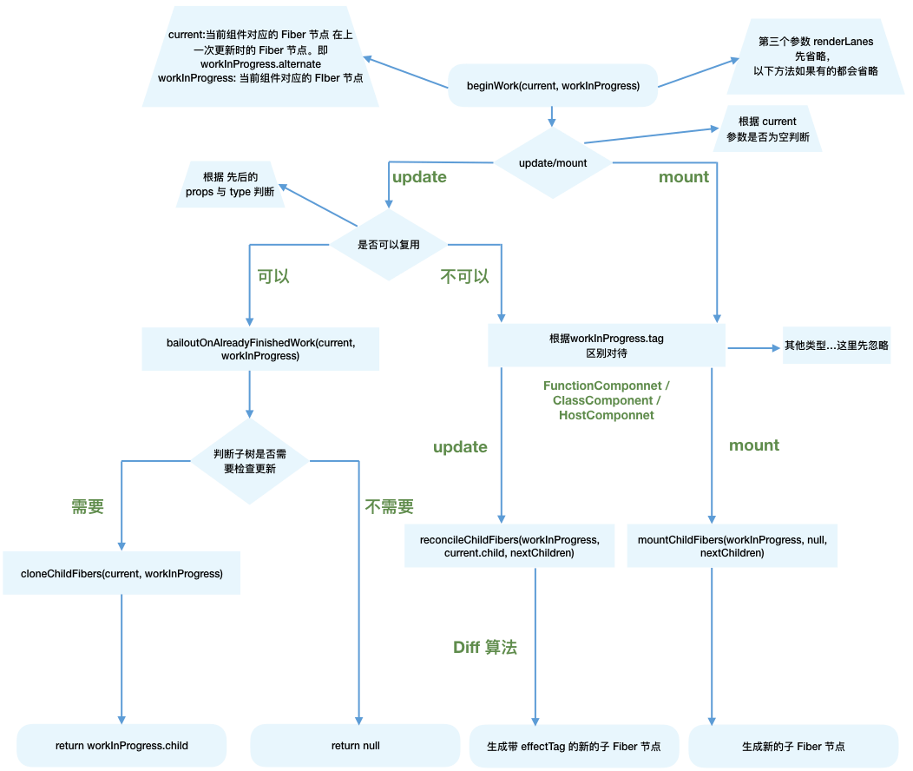
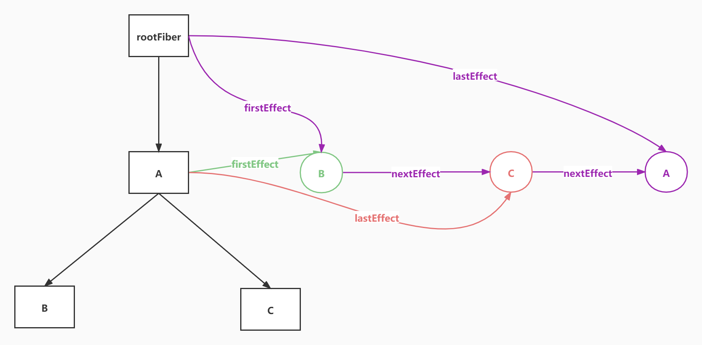

<!--
 * @Author: cc
 * @LastEditTime: 2023-01-15 17:15:39
-->
### React架构

1.**Scheduler**（调度器）—— 调度任务的优先级，高优任务优先进入Reconciler

2.**Reconciler**（协调器）—— 负责找出变化的组件

3.**Renderer**（渲染器）—— 负责将变化的组件渲染到页面上

<br/>

React是用**javaScript**构建快速响应的大型web应用的首选方式，何为快速响应？

当遇到大量操作计算或者设备性能产生的页面掉帧导致卡顿，发送网络请求后，由于需要等待数据返回才能进一步操作导致不能快速响应，这两类场景可以概括为**CPU**的瓶颈和**IO**的瓶颈，react如何解决？

在浏览器每一帧的时间中，预留一些时间给JS线程，React利用这部分时间更新组件（可以看到，在源码 (opens new window)中，预留的初始时间是5ms）
ƒ
这种将长任务分拆到每一帧中，像蚂蚁搬家一样一次执行一小段任务的操作，被称为时间切片（time slice）

IO的瓶颈如何解决

为此，React实现了**Suspense**功能及配套的hook——useDeferredValue

而在源码内部，为了支持这些特性，同样需要将**同步的更新**变为**可中断的异步更新**

<br/>

### React 工作循环


<br/>

### beginWork

当首屏渲染时，调用begingWork，同时通过root.current创建新的workInProgress，然后判断workInProgress !== null，while循环调用performUnitOfWork，performUnitOfWork当中开始进行beginWork，beginWork执行完毕，将新属性同步到老属性上面，unitOfWork.memoizedProps = unitOfWork.pendingProps，

beginWork的作用就是通过当前的Fiber创建子fiber，建立fiber链，根节点调用updateHostRoot，此时current和workInProgress一定会同时存在，调用reconcileChildren函数，传入current和workInProgess，，此时current !== null,直接走更新逻辑，通过reconcileSingleElement直接进行单节点的dom diff，因为首次child为null，调用createFiberFromElement通过jsx创建fiber节点，然后通过created.return = returnFiber，建立父子关系，返回created，执行完毕，返回workInProgress.child，

然后进行深度优先遍历,接下来因为一般render函数的第一个参数为函数组件，此时函数组件并没有alternate属性，所以current为空，设置**didReceiveUpdate**为false,**didReceiveUpdate**用来判断fiber是否有变化，通过pendingProps和memoizedProps比较来赋值didReceiveUpdate，在mount时FunctionComponent是按indeterminate处理的，调用mountIndeterminateComponent，取pendingProps，调用RenderWithHooks，判断current是否为null，调用HooksDispatcherOnMount或者HooksDispatcherOnUpdate，直接调用component函数，获取jsx对象，返回jsx对象，然后调用reconcileChildren对象，传入null，走初次渲染逻辑，初次渲染走插入逻辑，也就是将flags设置为2，走Placement逻辑，接着通过beingWork返回的的next，判断是否为Null，不为Null赋值workInProgress，循环performUnitOfWork逻辑，当next为null时，递的mount流程结束，调用completeUnitOfWork，完成第一个fiber节点，通过return和sibling，往上走到root。





### completeWork

首次渲染调用completeWork时，alternate为null，拿到newProps，也就是workInProgress的pendingProps，判断workInProgress.tag，如果为HostComponent，通过判断current和workInProgress.stateNode区分是更新还是初始化，初始化逻辑调用createInstance创建实例，由于是深度优先遍历，当workInProgress进行归阶段时，也就意味着其子树的dom节点已创建，所以只需将子树中离instance最近的dom节点追加到instance上即可，调用finalizeInitialChildren，初始化instance，也就是dom的属性，然后通过return和sibling向上初始化，完成之后，获取root.current.alternate，也就是workInProgress，设置为root.finishedWork，调用commitRoot。


### commitRoot

核心实现在于遍历副作用链表，实现更新逻辑

**commitBeforeMutationEffects**，class组件会在其中执行getSnapshotBeforeUpdate，因为只实现了functionComponent，所以可以忽略。

**commitMutationEffects**，mutation阶段，需要进行操作的HostComponent组件，会在这个阶段进行dom操作,在commitMutationEffects执行完毕之后，root.current = finishedWork，此时改变rootFiberNode的指针，指向最新的workInProgress。

**commitLayoutEffects**，LayoutEffects阶段，在其中执行useLayoutEffect的create函数，这就是他和useEffect最大的区别，useLayoutEffect执行的时间是在dom操作完成后，此时下一帧还没有开始渲染，此时如果做一些动画就非常适合，而如果把执行动画的操作放到useEffect中，因为他是被Scheduler模块调度，被postMessage注册到宏任务里面的，等到他执行时下一帧已经渲染出来，dom操作后的效果已经体现在了页面上了，如果此时动画的起点还是前一帧的话页面就会出现闪烁的情况。

<br/>

### collectEffectList

作为DOM操作的依据，commit阶段需要找到所有有effectTag的Fiber节点并依次执行effectTag对应操作。难道需要在commit阶段再遍历一次Fiber树寻找effectTag !== null的Fiber节点么？

这显然是很低效的。

为了解决这个问题，在completeWork的上层函数completeUnitOfWork中，每个执行完completeWork且存在effectTag的Fiber节点会被保存在一条被称为effectList的单向链表中。

effectList中第一个Fiber节点保存在fiber.firstEffect，最后一个元素保存在fiber.lastEffect。

类似appendAllChildren，在“归”阶段，所有有effectTag的Fiber节点都会被追加在effectList中，最终形成一条以rootFiber.firstEffect为起点的单向链表。

这样，在commit阶段只需要遍历effectList就能执行所有effect了。



```javaScript

  function collectEffectList(returnFiber, completedWork) {
    if (returnFiber) {
      //如果父亲 没有effectList,那就让父亲 的firstEffect链表头指向自己的头
      if (!returnFiber.firstEffect) {
        returnFiber.firstEffect = completedWork.firstEffect;
      } 
      //如果自己有链表尾
      if (completedWork.lastEffect) {
        //并且父亲也有链表尾
        if (returnFiber.lastEffect) {
          //把自己身上的effectlist挂接到父亲的链表尾部
          returnFiber.lastEffect.nextEffect = completedWork.firstEffect;
        }
        returnFiber.lastEffect = completedWork.lastEffect;
      }
      var flags = completedWork.flags; //如果此完成的fiber有副使用，那么就需要添加到effectList里
      if (flags) {
        //如果父fiber有lastEffect的话，说明父fiber已经有effect链表
        if (returnFiber.lastEffect) {
          returnFiber.lastEffect.nextEffect = completedWork;
        } else {
          returnFiber.firstEffect = completedWork;
        }

        returnFiber.lastEffect = completedWork;
      }
    }
  }
  let rootFiber = { key: 'rootFiber' };
  let fiberA = { key: 'A', flags: Placement };
  let fiberB = { key: 'B', flags: Placement };
  let fiberC = { key: 'C', flags: Placement };
  //rootFiber->A-BC 
  //B把自己的fiber给A
  collectEffectList(fiberA, fiberB);
  collectEffectList(fiberA, fiberC);
  collectEffectList(rootFiber, fiberA);
  
```

### React切片

React分为两种模式,render和createRoot两种入口,分为**legacy**和**concurrent**两种

**legacy模式**(同步)

render调用legacyRenderSubtreeIntoContainer，最后createRootImpl会调用到createFiberRoot创建fiberRootNode,然后调用createHostRootFiber创建rootFiber，其中fiberRootNode是整个项目的的根节点，rootFiber是当前应用挂在的节点，也就是ReactDOM.render调用后的根节点


**concurrent**模式(异步)

createRoot调用createRootImpl创建fiberRootNode和rootNode，在createRootImpl中调用listenToAllSupportedEvents初始化事件注册

创建完Fiber节点后，调用ReactDOMRoot.prototype.render执行updateContainer，然后scheduleUpdateOnFiber异步调度performConcurrentWorkOnRoot进入render阶段和commit阶段

不同点

在函数scheduleUpdateOnFiber中根据不同优先级进入不同分支，legacy模式进入performSyncWorkOnRoot，concurrent模式会异步调度performConcurrentWorkOnRoot

<br/>

### Fiber双缓存树

1.react根据双缓冲机制维护了两个fiber树，因为更新时依赖于老状态的

current Fiber树：用于渲染页面

workinProgress Fiber树：用于在内存构建中，方便在构建完成后直接替换current Fiber树

2.Fiber双缓存

首次渲染时：
render阶段会根据jsx对象生成新的Fiber节点，然后这些Fiber节点会被标记成带有‘Placement’的副作用，说明他们是新增节点，需要被插入到真实节点中，在commitWork阶段就会操作成真实节点，将它们插入到dom树中。

页面触发更新时
render阶段会根据最新的jsx生成的虚拟dom和current Fiber树进行对比，比较之后生成workinProgress Fiber(workinProgress Fiber树的alternate指向Current Fiber树的对应节点，这些Fiber会带有各种副作用，比如‘Deletion’、‘Update’、'Placement’等)这一对比过程就是diff算法

当workinProgress Fiber树构建完成，workInprogress 则成为了curent Fiber渲染到页面上

diff ⽐较的是什么？ ⽐较的是 current fiber 和 vdom，⽐较之后⽣成 workInprogress Fiber

## 

<br/>

### DomDiff

DomDiff 的过程其实就是老的 Fiber 树 和 新的 jsx 对比生成新的 Fiber 树 的过程，分为单节点和多节点两种分别对应**reconcileSingleElement**和**reconcileChildrenArray**

**只对同级元素进行比较**

**不同的类型对应不同的元素**

**可以通过key来标识同一个节点**

### 单节点

  1.新旧节点 type 和 key 都不一样，标记为删除

  2.如果对比后发现新老节点一样的，那么会复用老节点，复用老节点的 DOM 元素和 Fiber 对象
  再看属性有无变更 ，如果有变化，则会把此 Fiber 节点标准为更新

  3.如果 key 相同，但是 type 不同，则不再进行后续对比了，
  直接把老的节点全部删除


### 多节点

**第一轮**

1.如果key不同则直接结束本轮循环

2.newChildren或oldFiber遍历完，结束本轮循环

3.key相同而type不同，标记老的oldFiber为删除，继续循环

4.key相同而type也相同，则可以复用老节oldFiber节点，继续循环

**第二轮**

1.newChildren遍历完而oldFiber还有，遍历剩下所有的oldFiber标记为删除，DIFF结束

2.oldFiber遍历完了，而newChildren还有，将剩下的newChildren标记为插入，DIFF结束

3.newChildren和oldFiber都同时遍历完成，diff结束

4.newChildren和oldFiber都没有完成，则进行节点移动的逻辑

**第三轮**

处理节点移动的情况

<br/>

1.key相同,类型相同,数量相同

(更新#div#title)=>null

```javaScript
  <div key="title" id="title">
     div
  </div>

  <div key="title" id="title2">
    div2
  </div>
```

2.key相同,类型不同，删除老节点，添加新节点

(删除#div#title)=>(插入#p#title)=>null

```javaScript
  <div key="title" id="title">
   div
  </div>

  <p key="title" id="title">
   p
  </p>
```
3.类型相同,key不同,删除老节点，添加新节点

(删除#div#title1)=>(插入#div#title2)=>null

```javaScript
  <div key="title1" id="title">
    title
  </div>
  <div key="title2" id="title">
    title
   </div>
```

4.原来多个节点，现在只有一个节点,删除多余节点

(删除#li#A)=>(删除#li#C)=>(更新#li#B)=>null

```javaScript
  <ul key="ul">
    <li key="A">A</li>
    <li key="B" id="B">B</li>
    <li key="C">C</li>
  </ul>

  <ul key="ul">
    <li key="B" id="B2">B2</li>
  </ul>
```

5.多个节点的数量、类型和key全部相同，只更新属性

(删除#li#B)=>(插入#p#B)=>(更新#li#C)=>null

```javaScript
  <ul key="ul">
    <li key="A">A</li>
    <li key="B" id="B">B</li>
    <li key="C"id="C">C</li>
  </ul>

  <ul key="ul">
    <li key="A">A</li>
    <p key="B" id="B2">B2</p>
    <li key="C" id="C2" >C2</li>
  </ul>
``` 
6.多个节点的类型和key全部相同，有新增元素

(更新#li#B)=>(插入#li#D)=>null

```javaScript
  <ul key="ul">
    <li key="A">A</li>
    <li key="B" id="B">B</li>
    <li key="C">C</li>
  </ul>
  <ul key="ul">
    <li key="A">A</li>
    <li key="B" id="B2">B2</li>
    <li key="C">C</li>
    <li key="D">D</li>
  </ul>
```
7.多个节点的类型和key全部相同，有删除老元素

(删除#li#C)=>(更新#li#B)=>null

```javaScript
  <ul key="ul">
    <li key="A">A</li>
    <li key="B" id="B">B</li>
    <li key="C">C</li>
  </ul>
  <ul key="ul">
    <li key="A">A</li>
    <li key="B" id="B2">B2</li>
  </ul>
```

8.多个节点数量不同、key不同(难点，处理移动)

(删除#li#F)=>(移动#li#B)=>(插入#li#G)=>(插入#li#D)=>null

移动的核心在于lastPlaceIndex的值，默认lastPlaceIndex为0，拿新children索引和老children索引进行比较，如果老的fiber索引大于lasterPlaceIndex，则不需要移动，更新lastPlaceIndex的值，否则需要移动，lastPlaceIndex不变，循环结束，将剩下Fiber直接为Deletion

```javaScript
  <ul key="ul">
    <li key="A">A</li>
    <li key="B" id="b">B</li>
    <li key="C">C</li>
    <li key="D">D</li>
    <li key="E">E</li>
    <li key="F">F</li>
  </ul>
  <ul key="ul">
    <li key="A">A</li>
    <li key="C">C</li>
    <li key="E">E</li>
    <li key="B" id="b2">B2</li>
    <li key="G">G</li>
    <li key="D">D</li>
  </ul>
```


<br/>

### Fiber数据结构

Fiber有FiberRoot和普通Fiber节点，这里展示的普通Fiber节点

```javaScript
type Fiber = {
   /**
   * 该fiber节点处于同级兄弟节点的第几位
   */
  index: number
  /**
   * 此次commit中需要删除的fiber节点
   */
  deletions: Fiber[] | null
  /**
   * 子树带有的更新操作，用于减少查找fiber树上更新的时间复杂度
   */
  subtreeFlags: Flags
  /**
   *一个Bitset代表该fiber节点上带有的更新操作,比如第二位为1就代表该节点需要插入
   */
  flags: Flags
  /**
   * 新创建jsx对象的第二个参数,像HostRoot这种内部自己创建的Fiber节点为null
   */
  pendingProps: any
  /**
   * 上一轮更新完成后的props
   */
  memoizedProps: any
  /**
   *其子节点为单链表结构child指向了他的第一个子节点后续子节点可通过child.sibling获得
   */
  child: Fiber | null

  /**
   * 该fiber节点的兄弟节点，他们都有着同一个父fiber节点
   */
  sibling: Fiber | null
  /**
   * 在我们的实现中只有Function组件对应的fiber节点使用到了该属性
   * function组件会用他来存储hook组成的链表,在react中很多数据结构
   * 都有该属性，注意不要弄混了
   */
  memoizedState: any
  /**
   * 该fiber节点对于的相关节点(类组件为为类实例，dom组件为dom节点)
   */
  stateNode: any

  /**
   * 存放了该fiber节点上的更新信息,其中HostRoot,FunctionComponent, HostComponent
   * 的updateQueue各不相同，函数的组件的updateQueue是一个存储effect的链表
   * 比如一个函数组件内有若干个useEffect，和useLayoutEffect，那每个effect
   * 就会对应这样的一个数据结构
   * {
   *  tag: HookFlags //如果是useEffect就是Passive如果是useLayoutEffect就是Layout
   *  create: () => (() => void) | void //useEffect的第一个参数
   *  destroy: (() => void) | void //useEffect的返回值
   *  deps: unknown[] | null //useEffect的第二个参数
   *  next: Effect
   * }
   * 各个effect会通过next连接起来
   * HostComponent的updateQueue表示了该节点所要进行的更新，
   * 比如他可能长这样
   * ['children', 'new text', 'style', {background: 'red'}]
   * 代表了他对应的dom需要更新textContent和style属性
   */
  updateQueue: unknown  // 存储effect的链表

  /**
   * 表示了该节点的类型，比如HostComponent,FunctionComponent,HostRoot
   * 详细信息可以查看react-reconciler\ReactWorkTags.ts
   */
  tag: WorkTag

  /**
   * 该fiber节点父节点（以HostRoot为tag的fiber节点return属性为null）
   */
  return: Fiber | null

  /**
   * 该节点链接了workInPrgress树和current fiber树之间的节点
   */
  alternate: Fiber | null 

  /**
   * 用于多节点children进行diff时提高节点复用的正确率
   */
  key: string | null

  /**
   * 如果是自定义组件则该属性就是和该fiber节点关联的function或class
   * 如果是div,span则就是一个字符串
   */
  type: any

  /**
   * 表示了元素的类型，fiber的type属性会在reconcile的过程中改变，但是
   * elementType是一直不变的，比如Memo组件的type在jsx对象中为
   * {
   *  $$typeof: REACT_MEMO_TYPE,
   *  type,
   *  compare: compare === undefined ? null : compare,
   * }
   * 在经过render阶段后会变为他包裹的函数，所以在render前后是不一致的
   * 而我们在diff是需要判断一个元素的type有没有改变，
   * 以判断能不能复用该节点，这时候elementType就派上用场
   * 了，因为他是一直不变的
   */
  elementType: any

  /**
   * 描述fiber节点及其子树属性BitSet
   * 当一个fiber被创建时他的该属性和父节点一致
   * 当以ReactDom.render创建应用时mode为LegacyMode，
   * 当以createRoot创建时mode为ConcurrentMode
   */
  mode: TypeOfMode

  /**
   * 用来判断该Fiber节点是否存在更新，以及改更新的优先级
   */
  lanes: Lanes
  /**
   * 用来判断该节点的子节点是否存在更新
   */
  childLanes: Lanes
};
```
### useState

useState在mount和update中，分别对应**HooksDispatcherOnMount**中的mountState和**HooksDispatcherOnUpdate**中的updateState

```javaScript
  // 这里的currentlyRenderingFiber其实就是workInProgress
  ReactCurrentDispatcher.current = 
  current === null || current.memoizedState === null
        ? HooksDispatcherOnMount
        : HooksDispatcherOnUpdate;  
```

useState本质就是useReducer

useState在mout时使用的是**mountWorkInProgressHook**，而update使用的是**updateWorkInProgressHook**

+ **mountWorkInProgressHook**会在mount时执行，新建hook，并将所有的hook进行连接吗，同时返回链表的表尾

+ **updateWorkInProgressHook**大概逻辑为，如果第一次执行hook函数，从current获取memoizedState，也就是旧的hook，然后声明变量nextWorkInProgressHook，这里应该值得注意，正常情况下，一次renderWithHooks执行，workInProgress上的memoizedState会被置空，hooks函数顺序执行，nextWorkInProgressHook应该一直为null，那么什么情况下nextWorkInProgressHook不为null,也就是当一次renderWithHooks执行过程中，执行了多次函数组件，也就是在renderWithHooks中这段逻辑。

hook的数据结构

hook与FunctionComponent fiber都存在memoizedState属性，不要混淆他们的概念

+ fiber.memoizedState：FunctionComponent对应fiber保存的Hooks链表。

+ hook.memoizedState：Hooks链表中保存的单一hook对应的数据。

```javaScript
  const hook: Hook = {
    // 最新的useState的值
    memoizedState: "初始状态",
    // 初始化的useState的值
    baseState: "初始状态",
    // 用于更新的优先级
    baseQueue: null,
    //  新的updateQueue
    queue: {
        // 与极简实现中的同名字段意义相同，保存update对象
        pending: null,
        // 保存dispatchAction.bind()的值
        dispatch: null,
        // 上一次render时使用的reducer
        lastRenderedReducer: reducer,
        // 上一次render时的state
        lastRenderedState: (initialState: any),
    }
    // 下一个hook
    next: null,
  };
```
链表是另一种形式的链表存储结构,模拟源码enqueueUpdate方法

它的特点是最后一个节点的指针区域指向头节点，整个链表形成一个环，永远指向最后一个更新

```javaScript
// pedding.next指向第一个第一个更新，更新顺序是不变的，此为环状列表
  function dispatchAction(queue,action){
    const update = {action,next:null};
    const pedding = queue.pedding;
    if(pedding == null){
      update.next = update;
    }else{
      update.next = pedding.next;
      pedding.next = update;
    }
    queue.pedding = update;
  }
  //队列
  let queue = {padding:null};
  dispatchAction(queue,'action1')
  dispatchAction(queue,'action2')
  dispatchAction(queue,'action3')
  // queue = {pedding: { action: 'action3', next: { action: 'action1', next: {action:'2',next:{action:"3"}} } }}
  const peddingQueue = queue.pedding;
  // 源码中的遍历环形链表
  while(peddingQueue){
    let first = peddingQueue.pedding;
    let update = first;
    do{
       console.log(update)
       update = update.next;
    // 首尾相等终止循环
    }while(update !== first){}
  }
```
<br/>

### setState 是同步还是异步？

- 新版本 React18 是异步模式，React17版本是也是异步，但是在setTimeout中是同步

* React17 使用React.render (legacy同步模式),使用unstable_batchedUpdates可以解决在promise和setTimeout中不受React控制的问题,React18 使用 React.createRoot(concurrent异步模式)

- React 在执行 setState 的时候会把更新的内容放入队列

- 在事件执行结束后会计算 state 的数据，然后执行回调

- 最后根据最新的 state 计算虚拟 DOM 更新真实 DOM

* 优点

  1.为保持内部一致性，如果改为同步更新的方式，尽管 setState 变成了同步，但是 props 不是

  2.为后续的架构升级启用并发更新，React 会在 setState 时，根据它们的数据来源分配不用的优先级，这些数据来源有：事件回调句柄，动画效果等，再根据优先级并发处理，提升渲染性能

  3.setState 设计为异步，可以显著提升性能(非合成事件和钩子函数当中是同步的，例如 Promise 中就是同步)，使用 batchedUpdates 可以已经批量更新

```javaScript
     this.setState({ count: this.state.count + 1 });
     console.log(this.state.count); // 批量更新所以是 0
     this.setState({ count: this.state.count + 1 });
     console.log(this.state.count); // 批量更新所以是 0
     setTimeout(() => {
        this.setState({ count: this.state.count + 1 });
        console.log(this.state.count); // React18不用unstable_batchedUpdates也会异步批量所以是 1,react17版本会是同步2
        this.setState({ count: this.state.count + 1 });
        console.log(this.state.count); // React18不用unstable_batchedUpdates也会异步批量所以是 1,react17版本会是同步3
     });
```
<br/>

## 事件代理

+ 捕获事件是先注册先执行，冒泡事件是先注册后执行

- React17之前事件会冒泡到 document 上执行，所以导致和浏览器表现不一致(17 之后没问题了，因为挂到 root节点 上了)

+ 新版本在createRoot时，会调用createImpl，在root节点listenToAllSupportedEvents直接初始化事件系统

+ 事件的原则不管是捕获阶段还是冒泡阶段，都是先注册，先执行

```javaScript
  // result:事件是先注册先执行
  // 父元素React事件捕获
  // 子元素React事件捕获
  // 父元素原生事件捕获
  // 子元素原生事件捕获
  
  // 子元素原生事件冒泡
  // 父元素原生事件冒泡
  // 子元素React事件冒泡
  // 父元素原生事件冒泡

  // element.addEventListener(event, function, useCapture) useCapture === true ? '捕获' : '冒泡'，默认冒泡
  // e.preventDefault() 阻止事件默认行为
  // onClickCapture 捕获 onClick 冒泡
  // React16由于会冒泡到docuemnt上执行，所以会导致最后show为false
    componentDidMount(){
      this.setState({
        show:false
      })
    }
    handleClick = (event)=>{
      // event.nativeEvent.stopProgation(); // 不再向上冒泡了，但是本元素剩下的函数还会执行，也就是React16的话，依然会执行
      // event.nativeEvent.stopImmediateProgation(); // 阻止监听同一事件的其他事件监听器被调用，阻止后续事件代理到docuemnt上，可以解决React16合成事件的问题
      this.setState({
        show:true
      })
    }
    <button onClick={this.handleClick}></button>
    {this.state.show && <a>显示</a>}
```
<br/>
