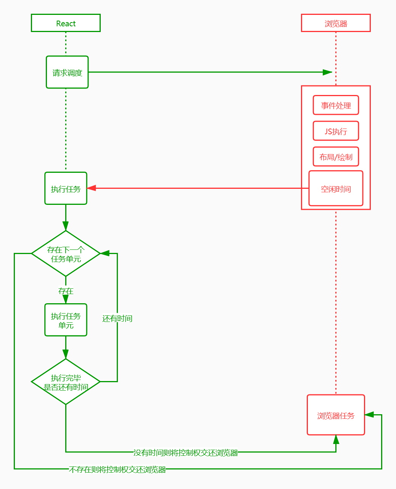
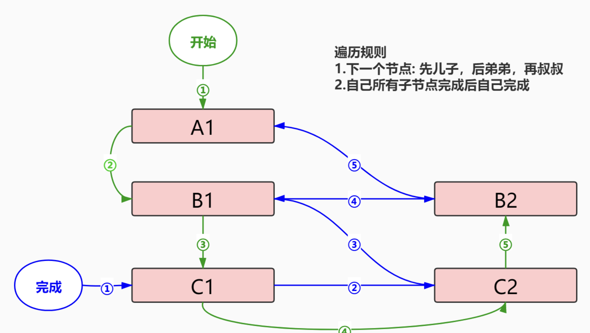
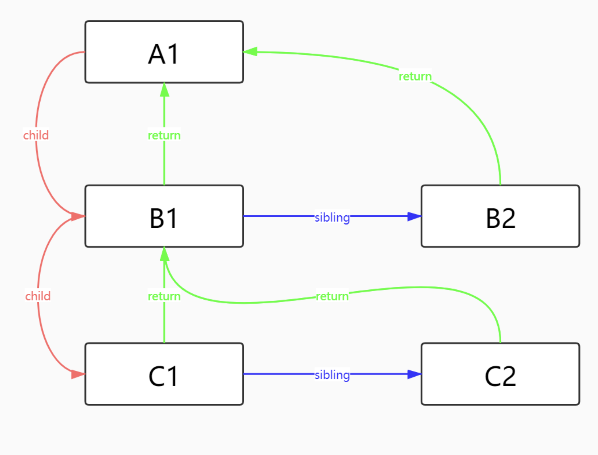

<!--
 * @Author: cc
 * @LastEditTime: 2022-06-08 16:14:52
-->

### React 源码解析

<br/>


```javaScript

// 真实Dom
 <div className="box" style={{color:'red'}}>
  <span>1</span>
  <p>2</p>
</div>

// 转换结果
 {
  type:"div",
  props:{
    className:"box"
  },
  children:[{
    type:"span",
    props:{
      style:{
        color:"red"
      },
      children:"hello"
    },
  },{
    type:"p",
    props:null,
    children:"2"
  }]
}
```

### React

1. React 元素不可变,不可以改变元素类型，例如{type:h1}修改为{type:h2}，禁止修改对象属性 Object.freeze(object)，其实就是改变 writeable 属性为 false

2. React 元素采用局部更新，只更新可变部分，domDiff,但是问题是更新的话，React 也要从组件的根节点更新，vue 是发布订阅，可以实现真正的局部更新

```javaScript
// 经典发布订阅结构
const list = [['国家大事',['小王']],['美女',['小常','小谢']]]
class EventBus {
  constructor() {
    this.eventBus = new Map();
  }
  on(eventName, message) {
    if (!this.eventBus.has(eventName)) {
      this.eventBus.set(eventName, []);
    }
    this.eventBus.get(eventName).push(message);
  }
  emit(eventName) {
    if (!this.eventBus.has(eventName)) return;
    for (let i = 0; i < this.eventBus.get(eventName).length; i++) {
      console.log(`${this.eventBus.get(eventName)[i]}收到${eventName}`);
    }
  }
}
let newEvent = new EventBus();
newEvent.on("国家大事", "小王");
newEvent.on("美女", "小常");
newEvent.on("美女", "小谢");
newEvent.emit("国家大事");
newEvent.emit("美女");
```

### 函数组件

1. 自定义组件必须是首字母大写 原生组件小写开头，自定义组件大写字母开头

2. 组件必须使用前先定义

3. 组件必须返回并且只能返回一个根元素

### 合成事件和批量更新


1. 在 React 中，事件的更新可能是异步的，是批量的，例如同时触发多个 setState

2. 调用 setState 状态并没有立刻更新，而是先缓存起来

3. 等事件处理函数执行完毕之后，再进行批量更新，一次更新并重新渲染

4. 因为 jsx 是由 React 函数控制，只要归 React 控制就是批量，只要不归 react 管，就是非批量

```javaScript
    this.setState({number:this.state.number+1});
    console.log(this.state.number); // 0
    this.setState({number:this.state.number+1});
    console.log(this.state.number); // 0
    // 第一个参数，获取最新的state
    // 第二个参数，回调函数，获取最新的state
    this.setState((lastState)=>{number:lastState.number+1},()=>{
        console.log(this.state.number) // 1
    })
     this.setState((lastState)=>{number:lastState.number+1},()=>{
        console.log(this.state.number) // 1
    })
    Promise.resolve().then(()=>{
        console.log(this.state.number); // 2
        this.setState({number:this.state.number+1});
        console.log(this.state.number); // 3
        sthis.etState({number:this.state.number+1});
        console.log(this.state.number); // 4
    })
```

### 父与子组件生命周期执行顺序

- 组件的调用顺序都是先父后子,渲染完成的顺序是先子后父。 组件的销毁操作是先父后子，销毁完成的顺序是先子后父

### react 老版生命周期

- 初始化：constructor -> componentWillMount->render->componentDidMount

- 更新：shouldComponentUpdate->componentWillUpdate->render->componentDidUpdate

- 卸载：componentWillUnmount

<br/>


<br/>

### react 新版生命周期

相对于老版，去除了几个 will 前缀生命周期,UNSAFE_componentWillUpdate,UNSAFE_componentWillMount,UNSAFE_componentWillReceiveProps。

- 创建时： constructor -> getDerivedStateFromProps -> render -> componentDidMount

- 更新时： getDerivedStateFromProps -> shouldComponentUpdate -> render -> getSnapShotBeforeUpdate -> componentDidUpdate

- 卸载时： componentWillUnmount

<br/>


<br/>

### componentWillReceiveProps 和 getDerivedStateFromProps 的区别

- componentWillReceiveProps(nextProps) 首次加载不会触发，父组件导致子组件更新时，即便 props 没变化，也会执行。

- getDerivedStateFromProps(nextProps, prevState) **首次加载**，**父组件更新**，**props**，**setState**，**forceUpdate** 都会触发，将父级传入的 props 映射到 state 上，新生命周期当中用来替代 componentWillReceiveProps,如果不改变，需要 return null

<br/>

### getSnapshotBeforeUpdate

- 获取 dom 更新前的信息，返回值传给 componentDidUpdate 第三个参数

<br/>

### React.createContext

- 创建执行上下文，用来向下传递属性，类组件可以挂载 contextType 静态属性，函数组件可以直接使用<Provider>和<Consumer>组件，主题切换之类的用的比较多

```javaScript
  let {Provider,Counsumer} = React.createContext(); // 返回{provider,consumer}
  <Provider value={color:'red',changeColor:this.changeColor}>
    <Child>
  </Provider>
  <Consumer>
    {
      ({color}=>{
        <p>{color}</p>
      })
    }
  </Consumer>
```

```javaScript
  //初始化默认值
  const MyContext = React.createContext({color:'red'});
  <MyContext.Provider value={color:'blue'}>
    <Child/>
  </MyContext.Provider>
  //另一种写法
  class Child extends React.Component {
    static contextType = MyContext;
    render() {
      let {color} = this.context;
    }
  }
```

### Fiber



Fiber 基于 requestAnimationFrame(宏任务) 和 MessageChanle(宏任务) 目前的做法是使用链表，每个虚拟节点内部表示一个 Fiber

#### Fiber 执行阶段

1.协调阶段：可以认为是 dom diff 阶段，这个阶段可以被中断，这个阶段找出所有的节点变更，例如节点新增，删除，属性变更，这些变更 Rect 称之为副作用(effect)

2.提交阶段：将上一个阶段计算出来的需要处理的 effect 一次性执行，这个阶段必须同步，不能被打断

A1 嵌套 B1，B2，B1 里嵌套 C1，C2

A1->B1->C1->C2->B2 深度优先



模拟嵌套节点的情况

```javaScript
    function sleep(duration) {
      let time = Date.now();
      while (duration + time > Date.now()) {}
    }
    let works = [
      () => {
        console.log("A1开始");
        sleep(30); // 挂起20ms
        console.log("A1结束");
      },
      () => {
        console.log("B1开始");
        console.log("B1结束");
      },
      () => {
        console.log("B2开始");
        console.log("B2结束");
      },
    ];
    // 告诉浏览器有空闲时间执行任务，但是如果已经过期，不管有没有空，都帮我执行
    requestIdleCallback(workLoop, { timeout: 1000 });
    function workLoop(deadLine) {
      console.log("本帧剩余时间ms", parseInt(deadLine.timeRemaining()));
      // 如果有剩余时间或者过期了
      while (
        (deadLine.timeRemaining() > 0 || deadLine.timeout) &&
        works.length > 0
      ) {
        performUnitWord();
      }
      if (works.length > 0) {
        // 返回当前帧的剩余秒数
        console.log(
          `只剩下${deadLine.timeRemaining()},时间片已经到期了，等待下次调度`
        );
        requestIdleCallback(workLoop);
      }
    }
    function performUnitWord() {
      let work = works.shift();
      work();
    }
```

requestAnimationFrame 用来替代 setTimeout，按帧执行，可以根据刷新率决定执行时间，隐藏不可见状态，不进行重绘和回流,减少 cpu 和 gpu 用量，高优先级

```javaScript

    <div style="background: blue; width: 0; height: 40px"></div>
    <button>开始</button>

    var div = document.querySelector("div");
    var button = document.querySelector("button");
    let startTime;
    function progress() {
      div.style.width = div.offsetWidth + 1 + "px";
      if (div.offsetWidth < 100) {
        console.log(Date.now() - startTime); // 16ms左右，较稳定 1000ms/60hz
        startTime = Date.now();
        requestAnimationFrame(progress);
        // 浏览器刷新间隔会执行requestAnimationFrame，根据系统的刷新频率决定，
        // 节省系统资源，改变视觉效果，用来替代setTimeout,属于高优先级任务
      }
    }
    button.onclick = () => {
      startTime = Date.now();
      requestAnimationFrame(progress);
    };

```

requestIdleCallback(宏任务) 用来控制任务单元，利用浏览器空余时间进行任务调度,低优先级 **只有 chrome 支持**,React 利用 MessageChannel(宏任务，MessageChannel 的 postMessage 的方法也是宏任务,在浏览器渲染之后执行) 模拟了 requestIdleCallBack,将回调延迟到绘制操作之后执行

```javaScript
    // MessageChannel就两个端口互相传递消息，用于iframe通信
    var channel = new MessageChannel();
    let port1 = channel.port1;
    let port2 = channel.port2;
    port1.onmessage = ({ data }) => {
      console.log("port1 msg", data);
    };
    port2.onmessage = ({ data }) => {
      console.log("port2 msg", data);
    };
    port1.postMessage("给Port2传递的消息");
    port2.postMessage("给Port1传递的消息");
```



### domDiff


### 执行队列


