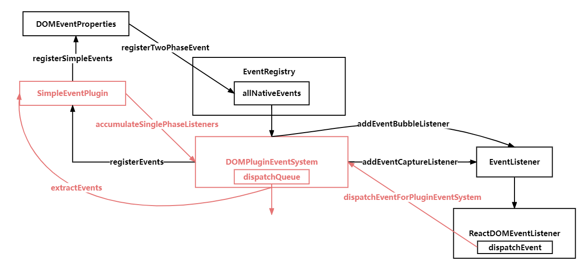

### 合成事件代理

合成事件是围绕浏览器原生事件充当跨浏览器包装器的对象,它们将不同浏览器的行为合并为一个 API,这样做是为了确保事件在不同浏览器中显示一致的属性，将事件代理在**root 根节点**。


`DOMPluginEventSystem`文件中，首先调用`registerEvents`函数，进行注册所有的事件

```javaScript
// 用于注册
const simpleEventPluginEvents = [
  'abort',
  'auxClick',
  'cancel',
  'canPlay',
  'canPlayThrough',
  ...
];
// 注册所有的简单事件
export function registerSimpleEvents() {
  for (let i = 0; i < simpleEventPluginEvents.length; i++) {
    const eventName = simpleEventPluginEvents[i]; //click
    const domEventName = eventName.toLowerCase(); //click
    const capitalizeEvent = eventName[0].toUpperCase() + eventName.slice(1); // Click
    registerSimpleEvent(domEventName, `on${capitalizeEvent}`); //click,onClick
  }
}
```

通过`topLevelEventsToReactNames`map 方法，进行事件的映射，类似于`click`=>`onClick`

```javaScript
export const topLevelEventsToReactNames = new Map();
function registerSimpleEvent(domEventName, reactName) {
  //把原生事件名和处理函数的名字进行映射或者说绑定，click=>onClick
  topLevelEventsToReactNames.set(domEventName, reactName);
  registerTwoPhaseEvent(reactName, [domEventName]); //'onClick' ['click']
}
```

`registerTwoPhaseEvent`注册两个阶段的事件，冒泡与捕获,通过`registerDirectEvent`方法可以吧所有的事件，添加到`allNativeEvents`set 数据结构中

```javaScript
/**
 * 注册两个阶段的事件
 * 当我在页面中触发click事件的时候，会走事件处理函数
 * 事件处理函数需要找到DOM元素对应的要执行React事件 onClick onClickCapture
 * @param {*} registrationName React事件名 onClick
 * @param {*} dependencies 原生事件数组 [click]
 */
export function registerTwoPhaseEvent(registrationName, dependencies) {
  //注册冒泡事件的对应关系
  registerDirectEvent(registrationName, dependencies);
  //注意捕获事件的对应的关系
  registerDirectEvent(registrationName + 'Capture', dependencies);
}
export function registerDirectEvent(registrationName, dependencies) {
  for (let i = 0; i < dependencies.length; i++) {
    allNativeEvents.add(dependencies[i]);//click
  }
}
```

至此，把所有的方法添加到`allNativeEvents`中,在`listenToAllSupportedEvents`函数可以直接遍历`allNativeEvents`结构，进行注册原生事件,`allNativeEvents`其实就是类似于['click','touch'l...]的结构

```javaScript
export function listenToAllSupportedEvents(rootContainerElement) {
  //监听根容器，也就是div#root只监听一次
  if (!rootContainerElement[listeningMarker]) {
    rootContainerElement[listeningMarker] = true;
    // 遍历所有的原生的事件比如click,进行监听
    allNativeEvents.forEach((domEventName) => {
      listenToNativeEvent(domEventName, true, rootContainerElement);
      listenToNativeEvent(domEventName, false, rootContainerElement);
    });
  }
}
```

`listenToNativeEvent`进行注册原生事件

```javaScript
/**
 * 注册原生事件
 * @param {*} domEventName 原生事件 click
 * @param {*} isCapturePhaseListener 是否是捕获阶段 true false
 * @param {*} target 目标DOM节点 div#root 容器节点
 */
export function listenToNativeEvent(domEventName, isCapturePhaseListener, target) {
  let eventSystemFlags = 0;//默认是0指的是冒泡  4是捕获
  if (isCapturePhaseListener) {
    eventSystemFlags |= IS_CAPTURE_PHASE;
  }
  addTrappedEventListener(target, domEventName, eventSystemFlags, isCapturePhaseListener);
}

function addTrappedEventListener(
  targetContainer, domEventName, eventSystemFlags, isCapturePhaseListener
) {
  // 监听事件
  const listener = createEventListenerWrapperWithPriority(targetContainer, domEventName, eventSystemFlags);
  if (isCapturePhaseListener) {
    addEventCaptureListener(targetContainer, domEventName, listener);
  } else {
    addEventBubbleListener(targetContainer, domEventName, listener);
  }
}

// 添加捕获事件
export function addEventCaptureListener(target, eventType, listener) {
  target.addEventListener(eventType, listener, true);
  return listener;
}
// 添加冒泡事件
export function addEventBubbleListener(target, eventType, listener) {
  target.addEventListener(eventType, listener, false);
  return listener;
}
```

创建事件监听，核心事件是`dispatchDiscreteEvent`

```javaScript
export function createEventListenerWrapperWithPriority(
  targetContainer,
  domEventName,
  eventSystemFlags
) {
  const listenerWrapper = dispatchDiscreteEvent;
  return listenerWrapper.bind(null, domEventName, eventSystemFlags, targetContainer);
}

/**
 * 派发离散的事件的的监听函数
 * @param {*} domEventName 事件名 click
 * @param {*} eventSystemFlags 阶段 0 冒泡 4 捕获
 * @param {*} container 容器div#root
 * @param {*} nativeEvent 原生的事件
 */
function dispatchDiscreteEvent(domEventName, eventSystemFlags, container, nativeEvent) {
  //在你是点击按钮的时候，需要设置更新优先级
  //先获取当前老的更新优先级
  const previousPriority = getCurrentUpdatePriority();
  try {
    //把当前的更新优先级设置为离散事件优先级 1
    setCurrentUpdatePriority(DiscreteEventPriority);
    //派发事件
    dispatchEvent(domEventName, eventSystemFlags, container, nativeEvent);
  } finally {
    setCurrentUpdatePriority(previousPriority);
  }
}
```

### 合成事件派发



`dispatchEvent`执行派发事件，这里其实通过调用`createInstance`方法时，调用`precacheFiberNode`方法，预先缓存 fiber 节点到 DOM 元素上，可以进行一一对应。

1. 收集沿途的绑定事件（onClick或者onClickCapture冒泡或捕获）

2. 基于原始事件参数event构造合成事件参数

3. 遍历捕获capture，依次执行

4. 遍历冒泡bubble，依次执行


```javaScript
/**
 * 此方法就是委托给容器的回调，当容器#root在捕获或者说冒泡阶段处理事件的时候会执行此函数
 * @param {*} domEventName
 * @param {*} eventSystemFlags
 * @param {*} container
 * @param {*} nativeEvent
 */
export function dispatchEvent(domEventName, eventSystemFlags, targetContainer, nativeEvent) {
  // 获取事件源，它是一个真实DOM，通过nativeEvent.target获取原生事件对象
  const nativeEventTarget = getEventTarget(nativeEvent);
  // 从真实的DOM节点上获取它对应的fiber节点，targetNode[internalInstanceKey]
  const targetInst = getClosestInstanceFromNode(nativeEventTarget);
  dispatchEventForPluginEventSystem(
    domEventName,//click
    eventSystemFlags,//0 4
    nativeEvent,//原生事件
    targetInst,//此真实DOM对应的fiber
    targetContainer//目标容器
  );
}
```

`dispatchEventForPluginEventSystem`，这里开始派发事件，从 targetFiber，从下往上遍历 Fiber 树，收集事件进行派发,`accumulateSinglePhaseListeners`方法里，通过 listeners 收集监听的事件

```javaScript

export function accumulateSinglePhaseListeners(
  targetFiber,
  reactName,
  nativeEventType,
  isCapturePhase
) {
  const captureName = reactName + "Capture";
  const reactEventName = isCapturePhase ? captureName : reactName;
  const listeners = [];
  let instance = targetFiber;
  while (instance !== null) {
    const { stateNode, tag } = instance; //stateNode 当前的执行回调的DOM节点
    if (tag === HostComponent && stateNode !== null) {
      const listener = getListener(instance, reactEventName);
      if (listener) {
        listeners.push(createDispatchListener(instance, listener, stateNode));
      }
    }
    instance = instance.return;
  }
  return listeners;
}
function createDispatchListener(instance, listener, currentTarget) {
  return { instance, listener, currentTarget };
}

```

调用`extractEvents`方法，这里通过不同的事件类型，构建不同的`SyntheticEventCtor`合成对象，将原生事件上拷贝到合成事件实例上，同时重写浏览器兼容

```javaScript
/**
 * 把要执行回调函数添加到dispatchQueue中
 * @param {*} dispatchQueue 派发队列，里面放置我们的监听函数
 * @param {*} domEventName DOM事件名 click
 * @param {*} targetInst 目标fiber
 * @param {*} nativeEvent 原生事件
 * @param {*} nativeEventTarget 原生事件源
 * @param {*} eventSystemFlags  事件系统标题 0 表示冒泡 4表示捕获
 * @param {*} targetContainer  目标容器 div#root
 */
function extractEvents(
  dispatchQueue,
  domEventName,
  targetInst,
  nativeEvent,
  nativeEventTarget,//click => onClick
  eventSystemFlags,
  targetContainer) {
  const reactName = topLevelEventsToReactNames.get(domEventName);//click=>onClick
  let SyntheticEventCtor;//合成事件的构建函数
  switch (domEventName) {
    case 'click':
      // 鼠标合成时间
      SyntheticEventCtor = SyntheticMouseEvent;
      break;
    default:
      break;
  }
  const isCapturePhase = (eventSystemFlags & IS_CAPTURE_PHASE) !== 0;//是否是捕获阶段
  const listeners = accumulateSinglePhaseListeners(
    targetInst,
    reactName,
    nativeEvent.type,
    isCapturePhase
  );
  //如果有要执行的监听函数的话[onClickCapture,onClickCapture]=[ChildCapture,ParentCapture]
  if (listeners.length > 0) {
    const event = new SyntheticEventCtor(
      reactName, domEventName, null, nativeEvent, nativeEventTarget);
    dispatchQueue.push({
      event,//合成事件实例
      listeners//监听函数数组
    });
  }
}
```

### 合成事件提取


```javaScript
function processDispatchQueue(dispatchQueue, eventSystemFlags) {
  //判断是否在捕获阶段
  const inCapturePhase = (eventSystemFlags & IS_CAPTURE_PHASE) !== 0;
  for (let i = 0; i < dispatchQueue.length; i++) {
    const { event, listeners } = dispatchQueue[i];
    processDispatchQueueItemsInOrder(event, listeners, inCapturePhase);
  }
}
```
`processDispatchQueueItemsInOrder`执行，遍历`dispatchListeners`,进行循环执行事件回调

```javaScript
function processDispatchQueueItemsInOrder(
  event,
  dispatchListeners,
  inCapturePhase
) {
  if (inCapturePhase) {
    //dispatchListeners[子，父]
    for (let i = dispatchListeners.length - 1; i >= 0; i--) {
      const { listener, currentTarget } = dispatchListeners[i];
      if (event.isPropagationStopped()) {
        return;
      }
      executeDispatch(event, listener, currentTarget);
    }
  } else {
    for (let i = 0; i < dispatchListeners.length; i++) {
      const { listener, currentTarget } = dispatchListeners[i];
      if (event.isPropagationStopped()) {
        return;
      }
      executeDispatch(event, listener, currentTarget);
    }
  }
}
```

调用`executeDispatch`执行真正的合成事件触发，合成事件实例的 currentTarget 是不断变化的，event.nativeEventTarget，它是原始的事件源(#root)，永远不变，event.currentTarget 是当前的事件源，它是会随着事件回调的执行不断变化的

```javaScript
function executeDispatch(event, listener, currentTarget) {
  event.currentTarget = currentTarget;
  listener(event);
}
```