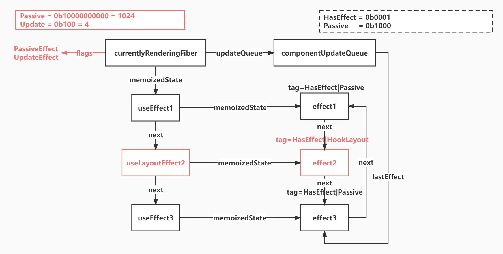
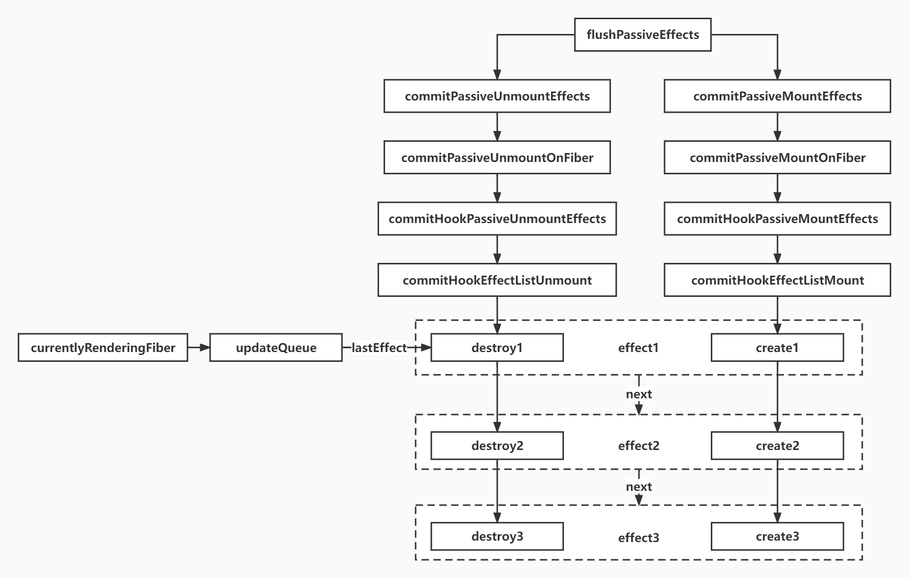

<!--
 * @Author: changcheng
 * @LastEditTime: 2023-10-05 21:12:17
-->
### useEffect

1. 在函数组件主体内（这里指在 React 渲染阶段）改变 DOM、添加订阅、设置定时器、记录日志以及执行其他包含副作用的操作都是不被允许的，因为这可能会产生莫名其妙的 bug 并破坏 UI 的一致性

2. 使用 useEffect 完成副作用操作。赋值给 useEffect 的函数会在组件渲染到屏幕之后执行。你可以把 effect 看作从 React 的纯函数式世界通往命令式世界的逃生通道

3. useEffect 就是一个 Effect Hook，给函数组件增加了操作副作用的能力。它跟 class 组件中的 componentDidMount、componentDidUpdate 和 componentWillUnmount 具有相同的用途，只不过被合并成了一个 API

4. 该 Hook 接收一个包含命令式、且可能有副作用代码的函数



### mountEffect

挂载`effect`

```javaScript
function mountEffect(create, deps) {
  return mountEffectImpl(PassiveEffect, HookPassive, create, deps);
}
/* function mountLayoutEffect(create, deps) {
  return mountEffectImpl(PassiveEffect, HookPassive, create, deps);
} */
function mountEffectImpl(fiberFlags, hookFlags, create, deps) {
  const hook = mountWorkInProgressHook();
  const nextDeps = deps === undefined ? null : deps;
  //给当前的函数组件fiber添加flags
  currentlyRenderingFiber.flags |= fiberFlags;
  hook.memoizedState = pushEffect(HookHasEffect | hookFlags, create, undefined, nextDeps);
}
/**
 * 创建函数组件的更新队列
 */
function createFunctionComponentUpdateQueue() {
  return {
    lastEffect: null
  }
}
```

### updateEffect

和`mountEffect`区别就是，要获取老的`effect`对象，拿到`deps`与`destroy`方法

```javaScript
function updateEffect(create, deps) {
  return updateEffectImpl(PassiveEffect, HookPassive, create, deps);
}
function updateEffectImpl(fiberFlags, hookFlags, create, deps) {
  const hook = updateWorkInProgressHook();
  const nextDeps = deps === undefined ? null : deps;
  let destroy;
  //上一个老hook
  if (currentHook !== null) {
    //获取此useEffect这个Hook上老的effect对象 create deps destroy
    const prevEffect = currentHook.memoizedState;
    destroy = prevEffect.destroy;
    if (nextDeps !== null) {
      const prevDeps = prevEffect.deps;
      // 用新数组deps和老数组deps进行对比，如果一样的话，跳过，不需要执行后面的pushEffect逻辑
      if (areHookInputsEqual(nextDeps, prevDeps)) {
        //不管要不要重新执行，都需要把新的effect组成完整的循环链表放到fiber.updateQueue中，这里传入hookFlags可以在后面commitHookEffectListMount跳过执行effect函数
        hook.memoizedState = pushEffect(hookFlags, create, destroy, nextDeps);
        return;
      }
    }
  }
  //如果要执行的话需要修改fiber的flags
  currentlyRenderingFiber.flags |= fiberFlags;
  //如果要执行的话 添加HookHasEffect flag
  //Passive还需HookHasEffect,因为不是每个Passive都会执行的，这里代表有effect执行
  hook.memoizedState = pushEffect(HookHasEffect | hookFlags, create, destroy, nextDeps);
}
```
添加`effect`链表

```javaScript
/**
 * 添加effect链表，循环链表
 * @param {*} tag effect的标签
 * @param {*} create 创建方法
 * @param {*} destroy 销毁方法
 * @param {*} deps 依赖数组
 */
function pushEffect(tag, create, destroy, deps) {
  const effect = {
    tag,
    create,
    destroy,
    deps,
    next: null
  }
  let componentUpdateQueue = currentlyRenderingFiber.updateQueue;
  if (componentUpdateQueue === null) {
    componentUpdateQueue = createFunctionComponentUpdateQueue();
    currentlyRenderingFiber.updateQueue = componentUpdateQueue;
    componentUpdateQueue.lastEffect = effect.next = effect;
  } else {
    const lastEffect = componentUpdateQueue.lastEffect;
    if (lastEffect === null) {
      componentUpdateQueue.lastEffect = effect.next = effect;
    } else {
      const firstEffect = lastEffect.next;
      lastEffect.next = effect;
      effect.next = firstEffect;
      componentUpdateQueue.lastEffect = effect;
    }
  }
  return effect;
}
```

### 执行effect的create方法和destory方法



在`commitRootImpl`执行中，先通过`finishedWork.subtreeFlags & Passive`|| `finishedWork.flags & Passive) !== NoFlags`，通过`scheduleCallback`函数开启宏任务，执行`flushPassiveEffect`

```javaScript
function commitRootImpl(root) {
  //先获取新的构建好的fiber树的根fiber tag=3
  const { finishedWork } = root;
  workInProgressRoot = null;
  workInProgressRootRenderLanes = NoLanes;
  root.callbackNode = null;
  root.callbackPriority = NoLane;
  //合并统计当前新的根上剩下的车道
  const remainingLanes = mergeLanes(
    finishedWork.lanes,
    finishedWork.childLanes
  );
  markRootFinished(root, remainingLanes);
  if (
    (finishedWork.subtreeFlags & Passive) !== NoFlags ||
    (finishedWork.flags & Passive) !== NoFlags
  ) {
    // 根节点是否有effect副作用
    if (!rootDoesHavePassiveEffect) {
      rootDoesHavePassiveEffect = true;
      Scheduler_scheduleCallback(NormalSchedulerPriority, flushPassiveEffect);
    }
  }
  //判断子树有没有副作用
  const subtreeHasEffects =
    (finishedWork.subtreeFlags & MutationMask) !== NoFlags;
  const rootHasEffect = (finishedWork.flags & MutationMask) !== NoFlags;
  //如果自己的副作用或者子节点有副作用就进行提交DOM操作
  if (subtreeHasEffects || rootHasEffect) {
    //当DOM执行变更之后
    commitMutationEffectsOnFiber(finishedWork, root);
    //执行layout Effect
    commitLayoutEffects(finishedWork, root);
    // 重置根节点effect标识
    if (rootDoesHavePassiveEffect) {
      rootDoesHavePassiveEffect = false;
      // 同时赋值为根节点
      rootWithPendingPassiveEffects = root;
    }
  }
  //等DOM变更后，就可以把让root的current指向新的fiber树
  root.current = finishedWork;
  //在提交之后，因为根上可能会有跳过的更新，所以需要重新再次调度
  ensureRootIsScheduled(root, now());
}
```

### flushPassiveEffect

执行effect的`create`方法和`destory`方法，先执行所有的`destory`方法，再执行`create`方法。

```javaScript
function flushPassiveEffect() {
  if (rootWithPendingPassiveEffects !== null) {
    const root = rootWithPendingPassiveEffects;
    //执行卸载副作用，destroy
    commitPassiveUnmountEffects(root.current);
    //执行挂载副作用 create
    commitPassiveMountEffects(root, root.current);
  }
}
```

### commitPassiveUnmountOnFiber & commitPassiveMountEffects

`commitPassiveUnmountEffects`与`commitPassiveMountEffects`几乎一致，都是通过调用`recursivelyTraversePassiveUnmountEffects`，从根节点往下遍历节点

```javaScript
function commitPassiveUnmountOnFiber(finishedWork) {
  const flags = finishedWork.flags;
  switch (finishedWork.tag) {
    case HostRoot: {
      recursivelyTraversePassiveUnmountEffects(finishedWork);
      break;
    }
    case FunctionComponent: {
      recursivelyTraversePassiveUnmountEffects(finishedWork);
      if (flags & Passive) {//1024
        commitHookPassiveUnmountEffects(finishedWork, HookHasEffect | HookPassive);
      }
      break;
    }
  }
}
// 遍历节点
function recursivelyTraversePassiveUnmountEffects(parentFiber) {
  if (parentFiber.subtreeFlags & Passive) {
    let child = parentFiber.child;
    while (child !== null) {
     // 重新回到commitPassiveUnmountOnFiber函数，继续递归
      commitPassiveUnmountOnFiber(child);
      child = child.sibling;
    }
  }
}
```

### commitPassiveMountEffects & commitPassiveUnmountEffects

`commitPassiveMountEffects`与`commitPassiveUnmountEffects`几乎一致，唯一的区别，一个是调用`destroy`方法，一个调用`create`方法，都是通过`finishedWork`的`updateQueue`拿到更新队列，进行更新，与`useReducer`与`useState`更新方法基本一致，都是循环链表

```javaScript
function commitHookEffectListMount(flags, finishedWork) {
  const updateQueue = finishedWork.updateQueue;
  const lastEffect = updateQueue !== null ? updateQueue.lastEffect : null;
  if (lastEffect !== null) {
    //获取 第一个effect
    const firstEffect = lastEffect.next;
    let effect = firstEffect;
    do {
      //如果此 effect类型和传入的相同，都是 9 HookHasEffect | PassiveEffect
      if ((effect.tag & flags) === flags) {
        const create = effect.create;
        // 拿到create的结果也就是destory函数    
        effect.destroy = create();
      }
      effect = effect.next;
    } while (effect !== firstEffect)
  }
}
```